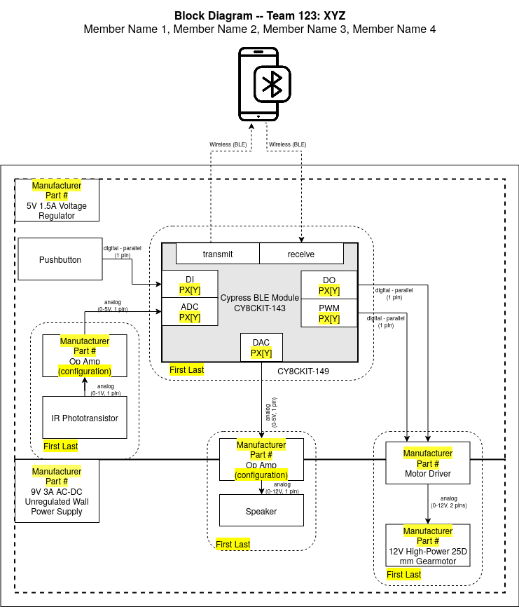
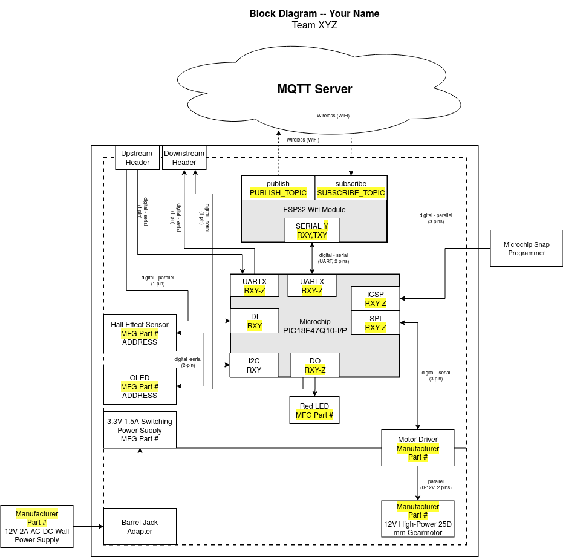
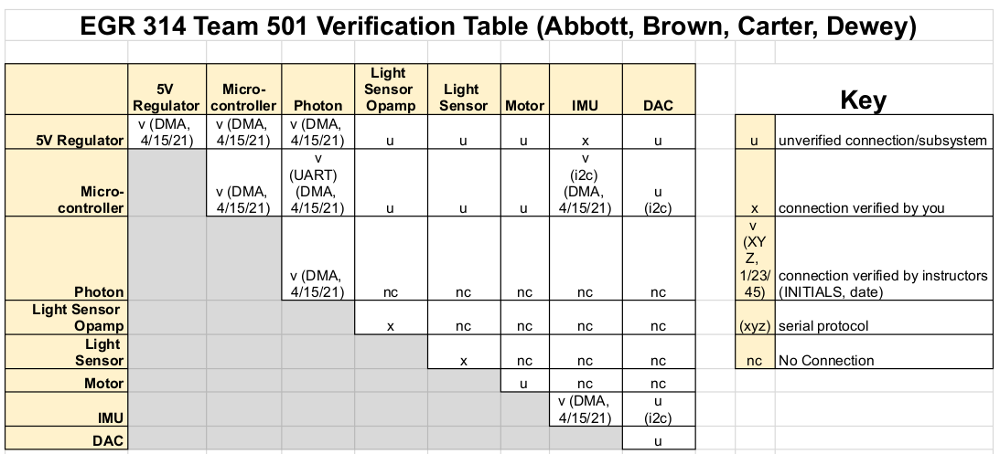

***Individual Assignment***

| EGR 304                                                                              | EGR 314                                                                              |
| ------------------------------------------------------------------------------------ | ------------------------------------------------------------------------------------ |
|  |  |

## Objectives

 To define the overall hardware architecture for your subsystem in a single combined block diagram.

## Resources

* [Drawing Software](https://embedded-systems-design.github.io/drawing-software/) on the Embedded Systems Design blog
* 314 Example block diagram ([draw.io template](https://www.dropbox.com/scl/fi/s5hxzttreels95wkpz08m/Block-Diagram-314.drawio?rlkey=i227aaxugntqeryntix4e7i68&st=xzoajjw7&dl=0))
    * [draw.io getting started](https://www.drawio.com)
* Course Documents
    * [314 Project Description](/314/project-description/)
    * [EGR 304/314 Course Sequence Requirements](/3x4/course-sequence-requirements/)
* Canvas discussion board

**We highly recommended that you closely follow the Example block diagram on the first page and review the [Most Common Mistakes](#most-common-mistakes) section below before completing the assignment.**

## Part 1: Block Diagram

Create a block diagram with the following features:

1. **Name and team information.** Student Name and associated team name.
1. **Block(s) for microcontroller(s).** There should be at least one microcontroller per individual subsystem, with space inside for peripherals.

    Include **Sub-blocks for each microcontroller peripheral.** Within each microcontroller block, add sub-blocks for each interface peripheral you plan to use in the microcontroller.

    * Indicate the type of peripheral you will use (e.g. PWM, ADC, DAC, UART, etc.). See [Table 1](#table1) for a more detailed explanation of how to label peripherals.
    * Indicate the pin(s) you will use within the sub-blocks. Reference the data sheet for each associated subsystem/component that will connect to the microcontroller to determine how many pins are necessary to connect. A range of pins, such as ```PX[Y]-PX[Z]``` should be replaced with the specific port numbers (e.g., ```P3[7]-P3[8]```). A single pin, as in ```PX[Y]```, should be replaced with the port number (e.g., ```P3[7]```).

1. **Power supplies.** Include dashed-line boxes for each of the voltage levels used within your subsystem. Place components within each of these boxes to indicate which supply the component requires (or across two adjoining boxes if the component requires both power levels). Label these boxes with the nominal voltage, whether the supply is regulated, and the maximum current available for each supply in a box in the upper left-hand corner.

    > *Please adjust the shape and location of each voltage box as needed to connect neighboring boxes as needed for two-voltage integrated circuits.*

1. **Blocks for each major electrical subsystem/component** (e.g., op amps, motor drivers, sensors, actuators, OLED, etc). Include manufacturer name **(not distributor)** part numbers (you may always change this later). If the subsystem is an opamp, include the type of amplifier circuit (e.g., non-inverting, inverting, comparator) in parentheses. Read the [EGR 304/314 Course Sequence Requirements](/3x4/course-sequence-requirements/) to review the required sensors, subsystems, and actuators for EGR 314.


1. **Directional labeled lines electrically connecting the blocks**. Use solid lines for any physical connection. Include arrows indicating the direction of signal flow. include text labeling the signal type and the number of signal pins. This information is important for determining how many pins and what peripherals (e.g., ADC, SPI) you need on a microcontroller. See [Table* *2](#table2) for examples of common power and signal labels.
1. **In Circuit Serial Programming interface**(PIC) _and/or_ **USB interface**(ESP32) to the PC.
1. Any other interfaces into or out of your subsystem, including additionaly plugs, programmers, USB connections, power, wireless connections not listed above.
1. Other information you feel is relevant to help describe the electrical architecture of your project.

*<a name="table1"></a>Table 1: Common microcontroller peripherals, their labels, and use cases.*

| **Type**                                           | **Subsystem Label** | **Typical Uses**                                                                                    |
| :------------------------------------------------- | :------------------ | :-------------------------------------------------------------------------------------------------- |
| Analog to Digital                                  | ADC                 | Converting external analog signals to digital values in a microcontroller                           |
| Digital to Analog                                  | DAC                 | Converting digital values in a microcontroller to external analog signals                           |
| Digital Input                                      | DI                  | Reading pushbuttons, comparators in a microcontroller                                               |
| Digital Output                                     | DO                  | Sending low-current boolean or on/off values to integrated circuits, transistors, or active devices |
| Pulse Width Modulation                             | PWM                 | Sending timed pulse chains to RC Servos or motor drivers                                            |
| Universal Asynchronous Receiver Transmitter (UART) | UART                | Typical serial communication, also known as RS-232                                                  |
|                                                    | SERIAL (EZ-BLE)     |                                                                                                     |
| Serial Peripheral Interface (SPI) Protocol         | SPI                 | Chip-to-chip, chip-to-board, board-to-board communication.                                          |
| I$^{\text{2}}$C Protocol                           | I2C                 | 2-wire chip-to-chip, chip-to-board, board-to-board communication                                    |
| USB-based serial                                   | USB                 | computer-to-microcontroller communication                                                           |

*<a name="table2"></a>Table 2:* Common power and signal types and labels (click the links to learn more)

| **Type**                     | **Label**                                                                 | **Label Examples**                                                                         | **Typical Uses**                                                                                         |
| ---------------------------- | ------------------------------------------------------------------------- | ------------------------------------------------------------------------------------------ | -------------------------------------------------------------------------------------------------------- |
| [Analog][AvsD]               | Analog (*Minimum Voltage - Maximum Voltage*, *Number of Signal Pins*[^1]) | Analog (0 - 3.3VDC, 1 pin)                                                                 | Analog output sensors, actuators that require an interface block to connect to a microcontroller, opamps |
|                              |                                                                           | Analog (0 - 5VDC [PWM][pwm], 1 pin)                                                        |                                                                                                          |
|                              |                                                                           | Analog (120VAC, 2 pins)                                                                    |                                                                                                          |
| [Digital - Parallel][serial] | Digital - Parallel (*Number of Signal Pins*)                              | Digital - Parallel (8 pins)                                                                | Buttons, keypads, parallel LCD screens, H-bridge control pins (may also be Analog PWM)                   |
| [Digital - Serial][serial]   | Digital - Serial (*Protocol*[^2], *Number of Signal Pins*)                | Digital - Serial ([I$^{\text{2}}$C][i2c], 2 pins)                                          | Accelerometers, addressable LED strips, digital temperature sensors, serial LCD screens                  |
|                              |                                                                           | Digital - Serial ([UART](http://www.circuitbasics.com/basics-uart-communication/), 2 pins) |                                                                                                          |
| Power                        | Power (*Voltage*)                                                         | Power (+12V DC)                                                                            | Used for power supply blocks only (not on lines)                                                         |
| Wireless                     | Wireless (Protocol)<BR>*(show with a dashed line)*                        | Wireless (Bluetooth Low Energy)                                                            | Bluetooth, WiFi, RF                                                                                      |

Sensors and actuators will communicate with the microcontroller using either analog and/or digital signals. For each signal (analog or digital), you must list the number of *signal* pins that will go between the sensor/actuator and microcontroller, **not including power or ground pins**. This is to ensure that you correctly calculate the number of pins that you need on a microcontroller.

**Example.** Consider a sensor with a 5-pin connector and a bidirectional [SPI interface](https://learn.sparkfun.com/tutorials/serial-peripheral-interface-spi). Three of the pins are for SPI communications (MOSI, MISO, and SCK) and two of the pins are for power and ground to the sensor. In the block diagram, the line connecting the sensor and microcontroller should have arrows on both ends (bidirectional), and 3 pins should be listed on the block diagram because this is the number of pins that must be reserved on the microcontroller.

<!-- ## Part 2: Project Verification Table

1. Copy the [Verification Table Example](https://www.dropbox.com/s/b2g9anxlmh5emlj/Verification%20Table%20Example%20and%20Template.xlsx?dl=0) for your own project
    1. List all of the major blocks in your block diagram on both the rows **and** the columns of the table. The rows and columns of the table should be identical (# rows = # columns). Include your power supplies even if they are off-the-shelf.
    1. Fill the diagonal from the upper left to the lower right corner with the letter u, meaning that these subsystems/components are unverified.
    1. Shade the cells below the diagonal (top right half of the table). You will be using the upper right half of the table.
    1. In the upper right half of the table (see *Table 1: Example Verification Table*), **complete every empty cell** with one of the following:
        1. u - "unverified connection" - if there is / should be a connection (power, analog, digital, or wireless) between the two subsystems/components that intersect at that cell. If the connection is serial, then it should also include the serial protocol (e.g., u (I2C)).
        1. nc - "no connection" - if there is not (and never will be) a connection (power, analog, digital, or wireless) between the two subsystems/components that intersect at that cell.

    > *Note that there should be no empty cells below the diagonal.*

 -->

## Homework Preparation and Submission

This work will be used -- and graded -- in multiple ways. It will be checked for completeness on the date given in Canvas.

### Preparation

Please prepare this assignment as a new page on your github webpage (your individual "datasheet").  Once completed,

* [x] Create a link to this new page on the datasheet's main landing page.
* [x] Check the link to ensure that it works
* [x] export this new page as a pdf

> The new page representing your assignment should not present as a page of links.  Do not use it to link to other documents *especially living documents*, such as google docs, draw.io drawings, or google sheets.    Rather, contents from other documents should be exported, saved in your repository, and hosted natively in markdown (or if need be html) in the page itself.

### Submission

To submit a complete assignment, please submit:

* [x] A working URL to the new block diagram page.
* [x] the **exported PDF** for easier review

Both items must be submitted, by the deadline in the Canvas course calendar, in order to receive full credit.  It is your responsibility to ensure that your submission to Canvas was successful. Late Canvas submissions will be graded per the policy in the syllabus.

## Grading

| **Item**                          | **Points** |
| :-------------------------------- | ---------: |
| Initial Submission (completeness) |         25 |
| External Review (quality)         |         75 |
| **Total**                         |    **100** |

### Completeness

The initial assessment of this assignment (on the due date in Canvas) will be for completeness.  Thus, no credit will be awarded for assignments not submitted -- or submitted incorrectly -- to Canvas.

### Qualitative Assessment

This document will assessed for quality by the teaching team when reviewed during the external design review.  Before then, please engage with the teaching team during office hours and/or classtime to review this document for ways to improve it.  We are happy to provide feedback, which will be your responsibility to integrate and address before the external design review.

### Subsequent Uses of this Document

As part of your individual datasheet, which is a public website, this document should be updated and improved throughout the semester in order to reflect your most current design.
This document will be used by your team to coordinate team-level decision-making, communication, and software development.
It will also be reviewed seen by external reviewers who will be given the opportunity to provide direct and indirect feedback, and as part of your team's final report.

### Design Checklist

Please make sure of the following:

* [x] Blocks for each major electrical subsystem/component are supplied
* [x] Your name and team number is included
* [x] Your internal serial data network (I2C / SPI) is not directly connected out to a teammate via the ribbon cable connectors
* [x] Blocks for microcontrollers missing sub-blocks for all peripherals
* [x] Analog or digital parallel lines from sensors point toward the microcontroller
* [x] Analog or digital parallel lines to actuators point away from the microcontroller
* [x] Serial communication lines utilize appropriate directionality. (I2C is bidirectional, SPI can have multiple unidirectional lines, depending)
* [x] Pin counts only represent *signal* pins, not power and ground
* [x] All lines between blocks have a signal type, voltage, and pin count
* [x] A wireless connection is included, if applicable
* [x] I2C addresses have been added, if applicable
* [x] Connections between blocks include directional arrows and labels
* [x] You include two ribbon cable connectors, one for your upstream neighbor, one for your downstream neighbor
    * [x] All pins of the ribbon cables used in your system are accounted for and wired to the appropriate block(s)
* [x] You have included a way to jumper or switch between onboard power and power supplied by your team (via jumpers, for example)
* [x] In circuit programming is accounted for
* [x] Microcontroller subsystems include specific IO callouts
* [x] Power supply blocks are present and include all necessary details (Part #, voltage, max current)
* [x] Part numbers and manufacturers are included for all ICs
* [x] Sensors and actuators include all required signal conditioning as seperate stages, or blocks
* [x] Actuators that require more than the microcontroller supply voltage (typically 5V or less) are not connected directly to a microcontroller
* [x] Every sensor and actuator is in a separate block (even if there are multiples)
* [x] Correct spelling is utilized in the diagram

[^1]: Signal pins transmit and receive data, e.g., to and from a microcontroller. Power and ground pins should not be counted because they connect to a power supply rather than input/output pins (I/O) on a microcontroller.
[^2]: The most common serial protocols are [I$^{\text{2}}$C](https://learn.sparkfun.com/tutorials/i2c?_ga=2.97189791.1677078136.1578610125-1273879729.1578610125), [SPI](https://learn.sparkfun.com/tutorials/serial-peripheral-interface-spi/all), [UART](http://www.circuitbasics.com/basics-uart-communication/), [TWI](https://www.i2c-bus.org/twi-bus/), [CAN](https://www.allaboutcircuits.com/technical-articles/introduction-to-can-controller-area-network/)
[serial]: <https://learn.sparkfun.com/tutorials/serial-communication>
[i2c]: <https://learn.sparkfun.com/tutorials/i2c>
[pwm]: <https://learn.sparkfun.com/tutorials/pulse-width-modulation>
[AvsD]: <https://learn.sparkfun.com/tutorials/analog-vs-digital>
