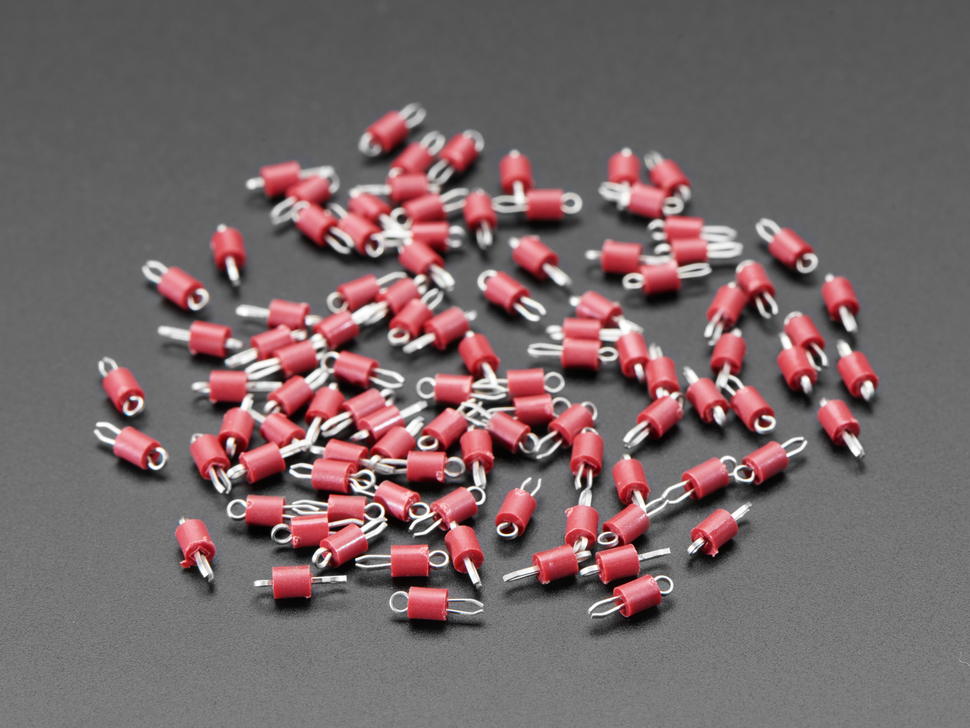
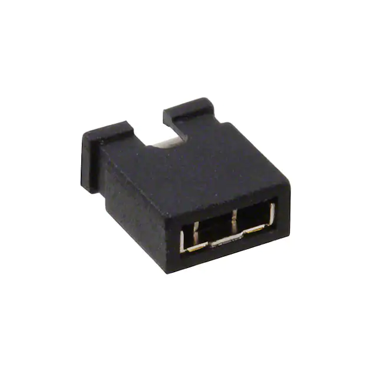
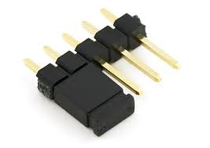
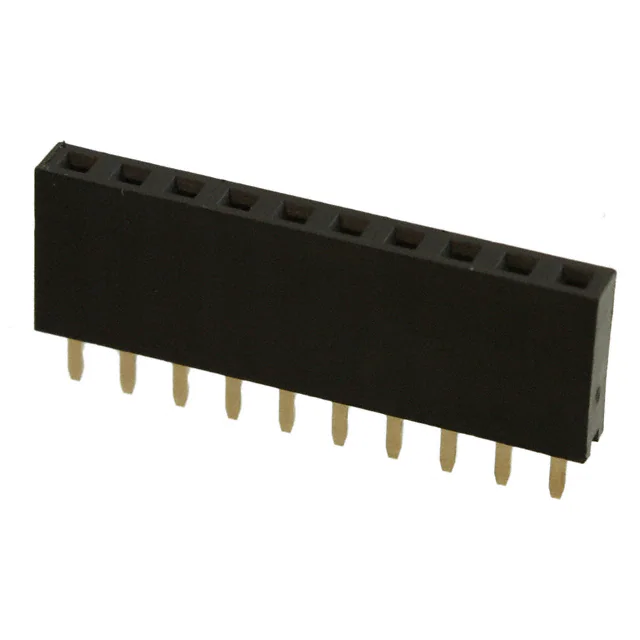
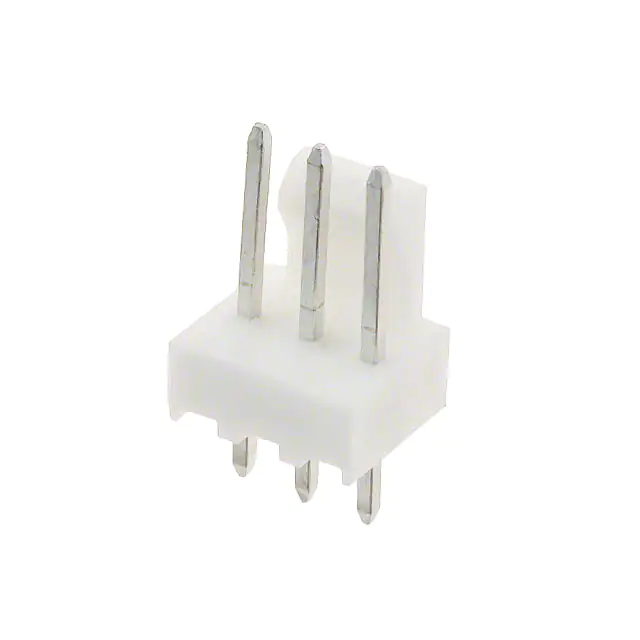
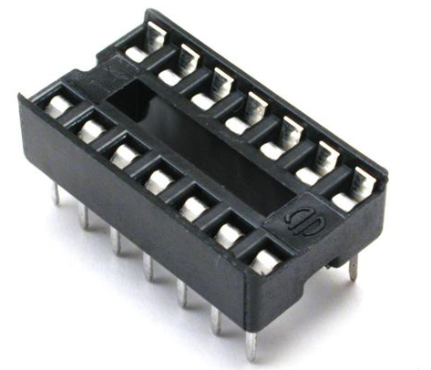
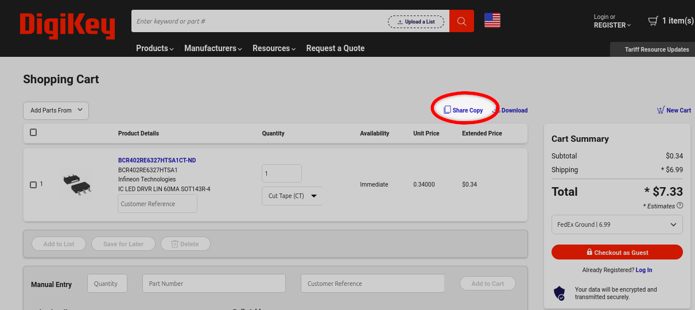

***Individual Assignment***

> **This is a two-part, individual homework assignment** but you may work with others to determine how to complete the assignment.  Your team's project assignments should inform the approach you take.

> One-half of this **Individual** assignment checkoff is of purchase request that you **email to your professor**. You will fill out a purchase request, **one for each vendor**, using the purchasing template you are requesting. Once you have your request(s) ready, you must email them to your professor to get the request process started.

> **Please email your orders to your <ins>Professor ASAP</ins> so that you don't miss later deadlines because of components not arriving in time!** It typicaly takes about five-plus business days for the ASU Poly's business office to process and recieve the items. **Watch stocking and estimated shipping time when creating your request.** 

## Objectives

The purpose of this assignment is to get an organized list of the supplies your system plans on needing so that you can complete your order form(s), submit via email, and obtain final buy-in approval from staff so that you can complete your system.

## Resources

* Embedded Systems Website:
    * [Sources for Electrical and Electromechanical Components](https://embedded-systems-design.github.io/sources-for-electrical-and-electromechanical-components/)
    * [From where can I source parts?](https://embedded-systems-design.github.io/from-where-can-i-source-parts/)
* [Component List](https://www.dropbox.com/s/k8ihfv7x51vmyhm/Spring%202023%20Order%20Planning.xlsx?dl=0) of all parts distributed in ICCs or purchased for Peralta 109 general stock
* [Bill of Materials example](https://www.dropbox.com/s/urnlk2rn0xu6hih/Bill%20of%20Materials%20Example.xlsx?dl=0)
* Canvas discussion board
* [Ordering Resources](https://www.dropbox.com/sh/0pu5curaf0s2bs8/AAC_PwZxVOF_R2ny7IMxwVjea?dl=0) folder
* [Class Order Form Template](https://www.dropbox.com/scl/fi/zhj1hgknkkmxri7umonv2/EGR-3x4-Purchase-Request-2021.xlsx?rlkey=b1t6y9gduqhp0jgk74gpbt737&dl=0)

## Instructions

1. Compile a bill of materials (BOM) that includes all of the components shown in your schematic.

    * Cadence
        1. In Cadence, navigate to Tools menu > Bill of Materials... to export a spreadsheet file that can be modified in Excel.
1. Use the Bill of Materials example (linked above) along with your Block Diagram, Component Selection, and **Schematic Design** to identify all the components you may need for the system you are responsible for the team's project.
    * List all components, even if they are found in Peralta or were handed out in class.
    * Download all datasheets and store them in your repository for later.
    * Don't forget to include hardware for debugging, expandability, and error-proofing, such as:

    | item                                          | notes                                                                                                                                                                                                                                                           |
    | --------------------------------------------- | --------------------------------------------------------------------------------------------------------------------------------------------------------------------------------------------------------------------------------------------------------------- |
    | test points                                   | {style="max-height:100px;"}                                                                                                                                                                                                                      |
    | jumpers                                       | {style="max-height:100px;"}{style="max-height:100px;"}                                                                                                                                                                            |
    | male/female headers                           | {style="max-height:100px;"}{style="max-height:100px;"}                                                                                                                                                                            |
    |                                               | *Note:* You don't need to order the exact size of header you need, if something longer is in stock. You can always cut a longer header to fit a smaller size. for example, if you have a 1x40 header, you can snap off 12 pins if you need a twelve-pin header. |
    |                                               | *Note:* Remember that the spacing on a breadboard is 2.54mm, or .1"                                                                                                                                                                                             |
    | "pcb-mount" connectors, sockets, and/or plugs | {style="max-height:100px;"}                                                                                                                                                                                                                      |
    |                                               | *Note:* "Molex" and "JST" are two, well-regarded brands that are considered the "kleenex" of connectors; these are good keywords to begin your search with.                                                                                                     |
    | fuses and fuse holders                        | *Note:* We have a selection of fuses, which can be found in Peralta 109.                                                                                                                                                                                        |
    | IC sockets                                    | {style="max-height:100px;"}                                                                                                                                                                                                                      |
    |                                               | *Note:* We have a wide selection of IC sockets on hand, which can be found in the parts closet in Peralta 109.                                                                                                                                                  |

1. Create a BOM to be included on your Individual GitHub Website and adding the information required.. You can either by using a copy of the BOM template linked and incorpate it into the website later or use the template a guide to add BOM table into GitHub.  **Order more than the minimum number needed.** This includes:
    * **1x per instance** of a  breadboard-compatible version, for fast prototyping and testing on a breadboard before you migrate to your PCB.
    * **1x-2x per instance** extra in case of damage.

    > **Note:** Considering delivery times and the cost of shipping vs the likely minimal cost of the part, please order at least 1-2 extra parts more than what you need per instance on the board unless it can be found in plenty in Peralta.

1. Sort the spreadsheet by vendor
1. Create **one order form per vendor** by copying the class order form template linked above
1. **NEW:** if you are ordering more than 10 items from a vendor like digikey, please -- in addition to your purchase request form -- include in your request a link to your "shopping cart" when possible.

    {style="max-height:200px;"}

1. When satisfied with your order, submit your order form(s) to your instructor for final approval. Please email your order as an **XLSX attachment** (to facilitate easy ordering by the ASU Poly Business team)
    * 314
        * 9:00 AM - Dr. Daniel Aukes <[danaukes@asu.edu](mailto:danaukes@asu.edu)>
        * 12:00 PM - Dr. Kevin Nichols <[kwnicho@asu.edu](mailto:kwnicho@asu.edu)>

  > **This will only get your request to be processed.** A Canvas submission of the request(s) is <ins>**still required**</ins> to ensure you will get credit for this portion of the assignment.

## Homework Preparation and Submission

This work will be used -- and graded -- in multiple ways. It will be checked for completeness on the date given in Canvas.

### Preparation

Please prepare this assignment as a new page on your GitHub webpage (your individual "datasheet").  Once completed,

* [x] Create a link to this new page on your individual datasheet's main landing page.
* [x] Check the link to ensure that it works
* [x] Export this new page as a PDF

> The new page representing your assignment should not present as a page of links.  Do not use it to link to other documents *especially living documents*, such as Google Docs, draw.io drawings, or Google Sheets.    Rather, contents from other documents should be exported, saved in your repository, and hosted natively in markdown (or, if need be, HTML) in the page itself.

### Submission

To submit a complete assignment, please submit:

* [x] A working URL to the new Bill of Material page.
* [x] The **exported PDF** for easier review
* [x] PDF copy for each purchase requests.

All items must be submitted by the deadline in the Canvas course calendar in order to receive full credit.  It is your responsibility to ensure that your submission to Canvas was successful. Late Canvas submissions will be graded per the policy in the syllabus.

## Grading

| **Item**                                              | **Points** |
| :---------------------------------------------------- | ---------: |
| Initial Submission of BOM (completeness)              |         25 |
| Initial Submission of Purchase Request (completeness) |         25 |
| Submission Final Report (quality)                     |         ~~50~~ 25 |
| **Total**                                             |     **~~100~~ 75** |

### Completeness

The initial assessment of this assignment (on the due date in Canvas) will be for completeness.  Thus, no credit will be awarded for assignments not submitted -- or submitted incorrectly -- to Canvas.

### Qualitative Assessment

This document will assessed for quality by the teaching team when reviewed during the external design review.  Before then, please engage with the teaching team during office hours and/or classtime to review this document for ways to improve it.  We are happy to provide feedback, which will be your responsibility to integrate and address before the external design review.

### Subsequent Uses of this Document

As part of your individual datasheet, which is a public website, this document should be updated and improved throughout the semester in order to reflect your most current design.
This document will be used by your team to coordinate team-level decision-making, communication, and software development.
It will also be reviewed by external reviewers, who will be given the opportunity to provide direct and indirect feedback as part of your team's final report.

### Most Common Mistakes

1. Requesting breakout component modules prior without approval.
2. Requesting very small components. (smaller than 0805)
3. Requesting small qualities of components that are sold in bulk only.
4. Requesting tools or general lab supplies. (solder, SMD resistor kits)
5. Requesting items that are back ordered or obsolete.
