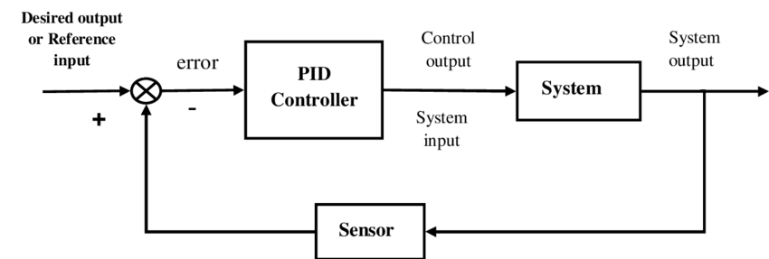

* Basic Feedback Control
    * <https://control.com/textbook/closed-loop-control/basic-feedback-control-principles/>
    * <https://www.electronics-tutorials.ws/systems/feedback-systems.html>
    * <https://ewh.ieee.org/sb/iiee/new/tutorials/feedback.pdf>
    * <https://microcontrollerslab.com/pid-controller-implementation-using-arduino/>


### Feedback Controllers

A feedback controller adjusts a system's input based on measurements of its output to achieve a desired response. It consists of a system being controlled, a feedback loop that compares the actual output to the desired output, and a controller that adjusts the input to the system based on the feedback.


Figure: Generic Feedback Controller Diagram[^1]

The general steps for how to write a feedback controller are:

1. **Choose a feedback control strategy:** There are different types of feedback control strategies such as proportional control, integral control, derivative control, and/or combinations of these (PID control). Choose the one that is best suited for your system.
1. **Determine the process variable:** The process variable is the variable that you want to control. This could be temperature, speed, position, etc.
1. **Measure the process variable:** Use a sensor to measure the process variable. The sensor output is typically an analog signal that needs to be converted to a digital value using an analog-to-digital converter (ADC).
1. **Calculate the error:** Subtract the measured value of the process variable from the desired setpoint value to obtain the error. The setpoint is the desired value of the process variable that you want to achieve.
1. **Calculate the control signal:** Use the feedback control strategy to calculate the control signal based on the error. For example, in proportional control, the control signal is proportional to the error.
1. **Apply the control signal:** The control signal needs to be converted to a form that can be used to drive the actuator. This could be a PWM signal, a digital signal, or an analog signal depending on the actuator.
1. **Repeat:** Continuously measure the process variable, calculate the error, and apply the control signal to the actuator to maintain the process variable at the desired setpoint.

> Note: The *repeat* part is often the hardest to implement, because the timing of your feedback control loop often depends on a predictable $\Delta t$.

Here is a basic example implemented in a controller's main loop:

```c
// define the setpoint value
int desired_setpoint = 50; 

// define the proportional gain
int Kp = 10; 

// define the measured process variable.  This could be a value you read from a sensor
int process_variable = 0; 

// define the error variable
int error = 0;

// define the calculated control signal
int control_signal = 0; 

//repeat continuously:
while(1)
{
    //read the analog input and convert to digital value
    process_variable = ADC_Read(); 

    // calculate the error
    error = desired_setpoint - process_variable; 

    // calculate the control signal
    control_signal = Kp * error; 

    // set the PWM duty cycle to the control signal
    PWM_Set_Duty(control_signal); 

    // wait for a short period before sampling again
    __delay_ms(10); 
}
```

How could you do this better?  Well, if you have other code running in your main loop, then a ```__delay_ms(10)``` may not guarantee that the loop takes just 10ms each time, especially if you are using ```printf()``` or other functions that can take a lot of processing time.

>What have you already learned about that guarantees regular and predictable timing regardless of what is going on in the main loop?  **Interrupts!**

### Part 2: Controller Design

1. Create a feedback controller diagram for your proposed feedback controller.  Indicate in the drawing:
    * the desired output
    * the source of your sensed value
    * the system -- typically an actuator and a physical "plant" or dynamical system
    * the planned controller type (P, I, D, PI, PD, Kalman, Bang-bang, etc).
1. Update your software diagram to include your controller implementation (if not already), using a timer-based interrupt to fire your your controller in an ISR callback.
1. Develop your controller *code* in MPLabX.   You do not need to have the rest of your team's code for the rest of the project included, just the code and MCC design that enables your feedback controller to work:
    1. Make sure MCC is set up for a timer-based interrupt
    1. Define your subsystems for sensor and your actuator.
    1. Enable Interrupts in main.c and connect your controller function to the timer callback.
1. (Optional) Test and demonstrate your controller with your alpha board, combined subsystems, or final prototype.

2. Controller Plan
    * Feedback Controller Diagram(pdf)
    * Updated Software Diagram(pdf)
    * Main.c
    * MPLabX workpace (zipped archive)
