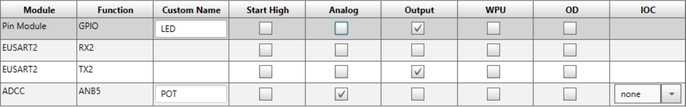
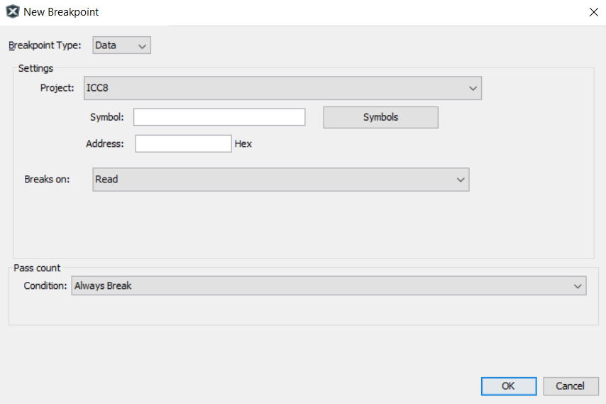

> This assignment is a ***paired in-class checkoff***. An **individual** live demonstration is required. You may work in pairs (**one** partner), but must individually demonstrate your working breadboard.

## Objectives

In this assignment, you will learn how to use the debugging tools in MPLabX. Debuggers help you determine run-time problems in your code, and also help to visualize what is happening inside a microcontroller.

With your partner, you must demonstrate proficiency in:

1. Utilizing breakpoints to verify functionality of code and hardware connections.
2. Using the variables window with watches to analyze and modify data values.

*An live demonstration is required.  You may work within pairs (**one** partner) to demonstrate this ICC.*

## Bill of Materials

| **Item**                                                    | **Details**                                                                     |
| :---------------------------------------------------------- | :------------------------------------------------------------------------------ |
| PIC18F47Q10  *or*  PIC18F47Q10 Curiosity Nano            |
| Programmer/Debugger                                         | Snap Programmer or  Pickit3/4/5 required for the DIP version of the PIC18F47Q10 |
| LED and current-limiting reesistor                          | only required for the DIP version of the PIC18F47Q10                            |
| Breadboard                                                  |                                                                                 |
| Voltage Regulator                                           | May use the breadboard-compatible unit distributed in class during week 1       |
| Jumper wires                                                |                                                                                 |
| Potentiometer (a voltage divider may be used in a pinch) | 10 kΩ                                                                           |
| Micro USB cable                                             |                                                                                 |

## Resources

* Scherz, P., & Monk, S. (2016). [Practical electronics for inventors, fourth edition.](https://www.amazon.com/Practical-Electronics-Inventors-Fourth-Scherz/dp/1259587541/ref=sr_1_1?s=books&ie=UTF8&qid=1470699914&sr=1-1&keywords=practical+electronics+for+inventors+4th+edition) New York: McGraw Hill. ISBN: 978-1259587542
    * Potentiometers - Scherz & Monk, Chapter 3.5.6 and 3.5.7
* Analog and ADCs
    * Analog input - Scherz & Monk, Chapter 13.5.2
* [PIC18F47Q10 Datasheet](https://ww1.microchip.com/downloads/en/DeviceDoc/PIC18F27-47Q10-Data-Sheet-40002043E.pdf)
* [PIC18F47Q10 Curiosity Nano](https://www.microchip.com/Developmenttools/ProductDetails/DM182029) Microchip Main Page
    * [Hardware User Guide](https://ww1.microchip.com/downloads/en/DeviceDoc/PIC18F47Q10-Curiosity-Nano-Hardware-User-Guide-40002103B.pdf) - Figure 4-1. Curiosity Nano Pinout
    * [Schematic](https://ww1.microchip.com/downloads/en/DeviceDoc/PIC18F47Q10-CNANO_Schematics.pdf)
* [ASCII to HEX Table](https://www.rapidtables.com/code/text/ascii-table.html)
* [Decimal to Hex Converter](https://calculator.name/baseconvert/decimal/hexadecimal)
* MPLabX Tutorials <a id="mplabxtutorials">:
    * [Breakpoints](https://microchipdeveloper.com/mplabx:breakpoints)
    * [Debugging Basics](https://microchipdeveloper.com/mplabx:debugging)
    * [Debugging Toolbar](https://microchipdeveloper.com/mplabx:debug-toolbar)
    * [Watches VS Variables](https://microchipdeveloper.com/mplabx:watches-vs-variables)
    * [Variables Window](https://microchipdeveloper.com/mplabx:variables-window)
    * [Watches in Variables View](https://microchipdeveloper.com/mplabx:watches-in-local-variables-view)
    * [Enable/Disable Variables](https://microchipdeveloper.com/mplabx:show-all-some-local-variables)
* [Advanced Debugging Playlist](https://youtube.com/playlist?list=PLtQdQmNK_0DTsTgCR47l9l6HHQIb6b3-T)

## Prior to Demonstration of Proficiency

1. Read and search the various MPLabX [links](#mplabxtutorials) listed above to familiarize yourself with the following concepts:
    1. Debugging Toolbar functionality
    1. Breakpoint types in MPLabX
    1. Watches and Variables in MPLabX
    1. Variable and Watch windows
1. *(Only required if using the Curiosity Nano version of the microcontroller)* Read and search the *PIC18F47Q10 Curiosity Nano Pinout* section of the [Curiosity Nano Hardware User Guide](https://ww1.microchip.com/downloads/en/DeviceDoc/PIC18F47Q10-Curiosity-Nano-Hardware-User-Guide-40002103B.pdf) to identify the following:
    1. Which pin is connected to the onboard LED?
    1. Which pins can be used for ADC input?
1. *(Only required if using the DIP version of the PIC18F47Q10)*
    1. Select/Choose an output pin for driving the external LED
    1. Review the PIC18F47Q10 [datasheet](https://ww1.microchip.com/downloads/en/DeviceDoc/PIC18F27-47Q10-Data-Sheet-40002043E.pdf).  Which pins can be used for ADC input?
1. Wire the wiper pin of an external potentiometer to an appropriate GPIO pin on the Nano, with its other two pins connected to power and ground, respectively.
1. Open MPLabX IDE and plug the Curiosity Nano board or Snap Programmer into the USB port of your computer. Create a new project for the PIC18F47Q10.
1. Open MCC, then add and configure the following peripherals:

    1. System Module:
        1. Select the HFINTOSC (high frequency internal oscillator) at 4 MHz.

    1. System Module --> Clock Control:
        1. Clock Source: Select the HFINTOSC (high frequency internal oscillator) at 4 MHz.
        1. Keep the clock divider at 4
    1. System Module --> Configuration Bits
        1. Disable the Watchdog timer (WDT_Disable)
    1. Add Drivers --> ADC (for reading the analog potentiometer voltage):
        1. Select Enable ADC
        1. Computation mode: Basic
        1. **UPDATED: Clock Source: FOSC**
        1. Clock: FOSC/4
        1. **NEW: Disable "Generate Interrupt APIs"**
        1. Keep all other settings default
    1. UART (*for connecting the Curiosity Nano to PC or other Device, not required for the DIP version*):
        1. Select Dependency: EUSART2
        1. Enable UART
        1. **REMOVED: Enable Transmit**
        1. **REMOVED: Enable Receive**
        1. Redirect Printf to UART
        1. Keep all other settings default
6. Open up the pin manager grid and configure it as follows:

    

7. Paste the following code into main.c:

        #include "mcc_generated_files/system/system.h"
        #include <stdio.h>

        uint8_t count = 0;
        adc_result_t pot=0;// potentiometer variable

        void main(void)
        {
            SYSTEM_Initialize();
            ADC_Initialize();
            EUSART2_Initialize();
            while (1)
            {
                count++;
                pot=ADC_ChannelSelectAndConvert(POT);
                printf("Count: %un",count); //only works with the Curiosity Nano
                if(pot>=520)
                {
                    LED_SetHigh(); // turns off LED
                }
                if(pot<520)
                {
                    LED_SetLow(); // turns on LED
                }
            }
        }

## Part 1. Line Breakpoint

1. Set a breakpoint on count++;
2. Turn the potentiometer to its maximum value and open debugger
3. Step over the entirety of the code and watch the LED state
4. Click reset and turn the potentiometer to its lowest value
5. Repeat step 3, what happens to the LED after each step? When does it turn on?
6. Explain the use of the breakpoint in the context of the debugger and describe how you interpret "stepping over" the code.

## Part 2. Analog value breakpoint

In this section, you will set a data breakpoint on the incoming potentiometer voltage that is being read by the ADC. This is useful when waiting for a certain value from the ADC.

1. Remove the breakpoint on count++;
2. Click on change visible columns in the top right of the variables window and select decimal. 
3. In the variables tab, add the watch "pot". Right click → new watch → global symbols → pot → select okay
4. Set a data breakpoint to stop once the "pot" register reads the number "1023" (in hexadecimal). ([Decimal to Hex](https://calculator.name/baseconvert/decimal/hexadecimal)) Go to window → debugging → breakpoints → select create new breakpoint  → under the drop down select data. You will see the following:

    

    1. Select the potentiometer register by clicking on symbols → global symbols→ pot → and select okay, the address will be displayed automatically.
    1. Select breaks on: read specific value, paste the hex value for the number "1023" in this section ( hint: see [Decimal to Hex](https://calculator.name/baseconvert/decimal/hexadecimal) )
    1. Select okay, you should now see the following under the breakpoints tab:

5. Return to the variables tab and run the code. What is the output on the watch when the break occurs?

## Part 3. Write to a register using the Variable view

In this section, you will modify a variable value in currently running code. This is useful if you are trying to simulate sensor data to test your logic.

1. Set a breakpoint on count++;
2. Open the variables view by going to window → debugging → variables
3. Set a new "count" watch. Right click → new watch → global symbols → count → select okay
4. You should now see a new watch called count, press continue on the debugger toolbar
5. Observe the changes to the watch columns as you press continue.
6. Type a number of your choosing into the decimal column and press enter (you should see the count row values turn red)
7. Repeat step 5. (You should see your decimal value increase starting from the value typed in)

## Part 4. Serial Data Breakpoint *(not required for DIP version of the PIC18F47Q10)*

In this section, you will set a data breakpoint on the UART. This is useful when you are waiting for a particular character to be sent over the UART.

1. Remove the breakpoint on count++;
2. In the variables tab, make the Char column visible
3. In the variables tab,add the SFR/watch "TX2REG". Right click → new watch → SFRs → TX2REG → select okay
4. Set a data breakpoint to stop once the TX2REG UART register writes the letter "o" (in hexadecimal). ([ASCII to HEX Table](https://www.rapidtables.com/code/text/ascii-table.html)) Go to window → debugging → breakpoints → select create new breakpoint  → under the drop down select data. You will see the following:

    

    1. Select the TX2REG by clicking on symbols → SFRs → TX2REG → and select okay, the address will be displayed automatically.
    1. Select breaks on: write specific value, paste the hex value for the letter "o" in this section ( hint: see [http://asciitable.com](http://asciitable.com) )
    1. Select okay, you should now see the following under the breakpoints tab:

5. Return to the variables tab and run the code. What is the output on the watch when the break occurs?

## Demonstration of Proficiency in Pairs

In class, demonstrate the following **live** to a member of the Teaching Team by the end of class:

1. Explain breakpoints and why you are "stepping over" the code.
2. Demonstrate reading an analog value of 1023 (decimal) in the Variables tab.  Show how changing the potentiometer's wiper (or the voltage divider resistance values) changes the value read.
3. Modify the "count" register using the debugger.
4. (optional, only possible with the Curiosity Nano) Show the UART receiving an "o" character in the Variables tab of the debugger.

**A live demonstration by the end of class is required. No late demonstrations will be accepted.**

## Canvas Submission

**No Canvas submission is required.**

## Grading

| **Demonstration** | **Points** |
| ----------------- | ---------- |
| Demonstration 1   | 20         |
| Demonstration 2   | 40         |
| Demonstration 3   | 40         |
| **Total**         | **100**    |

<!-- | Demonstration 4   | 40         | -->
<!-- > > Note: This tutorial was originally written for MCC Classic. MCC "Melody" has a slightly updated interface, but most of the instructions here should still apply.  Please be patient as we update the instructions, and let us know if you find inconsistencies. -->

