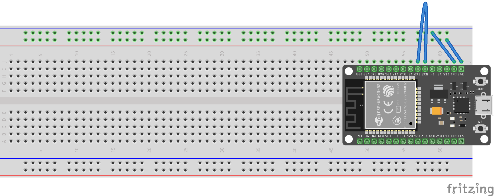
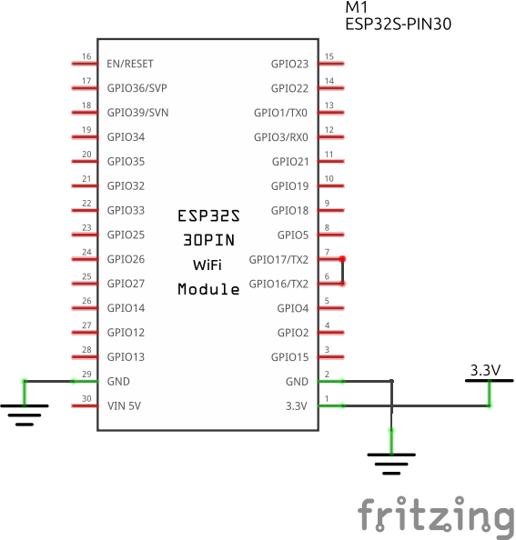

> This assignment is a ***paired in-class checkoff***. An **individual** live demonstration is required. You may work in pairs (**one** partner), but must individually demonstrate your working breadboard.

## Objectives

The purpose of this assignment is to get your ESP32 DevKit working with micropython. You will 1) install the miniconda distribution of python, 2) use this python environment to install the thonny IDE, 3) download and flash the micropython firmware to the ESP32, and 4) work with the interpreter to start coding with python.

-- Here is a Walkthrough Video Thanks Manny!

<iframe width="560" height="315" src="https://www.youtube.com/embed/YPAr3djpvTc?si=HPZ7I8OAMXz7B74h" title="YouTube video player" frameborder="0" allow="accelerometer; autoplay; clipboard-write; encrypted-media; gyroscope; picture-in-picture; web-share" referrerpolicy="strict-origin-when-cross-origin" allowfullscreen></iframe>

## Resources

- The [Embedded Systems Resources](https://embedded-systems-design.github.io/) blog
    - [EGR314 Software Downloads](https://embedded-systems-design.github.io/egr314-software-stack)
    - [ESP32 DevKit Resources](https://embedded-systems-design.github.io/tutorials/esp32/)
    - [Installation instructions](https://embedded-systems-design.github.io/esp32-installation-and-setup/)
- RandomNerdTutorials
    - [Micropython and ESP32 Introduction](https://randomnerdtutorials.com/micropython-programming-basics-esp32-esp8266/)
    - [MicroPython GPIOs](https://randomnerdtutorials.com/micropython-gpios-esp32-esp8266/)
    - [MicroPython Inputs Outputs](https://randomnerdtutorials.com/esp32-esp8266-digital-inputs-digital-outputs-micropython/)
    - [MicroPython Analog Inputs](https://randomnerdtutorials.com/esp32-esp8266-analog-readings-micropython/)
- Canvas Discussion Board
- Scherz, P., & Monk, S. (2016). [Practical electronics for inventors, fourth edition.](https://www.amazon.com/Practical-Electronics-Inventors-Fourth-Scherz/dp/1259587541/ref=sr_1_1?s=books&ie=UTF8&qid=1470699914&sr=1-1&keywords=practical+electronics+for+inventors+4th+edition) New York: McGraw Hill. ISBN: 978-1259587542 *(**many** circuit design resources)*

## Prior to Demonstration of Proficiency

1. Ensure you have downloaded and installed VSCode and Git: <https://embedded-systems-design.github.io/egr314-software-stack>
    1. set VSCode up with the pymakr-preview and git-graph extensions: <https://embedded-systems-design.github.io/vscode-setup/>
1. Review the [Overview of the ESP32 DevKit DOIT V1](https://embedded-systems-design.github.io/overview-of-the-esp32-devkit-doit-v1/)
1. Follow the steps outlined in the [ESP32 Installation and Setup](https://embedded-systems-design.github.io/esp32-installation-and-setup/) tutorial
1. Review the following pages
    - [VS Code Setup and Usage](https://embedded-systems-design.github.io/vscode-setup/)
    - [Using the Pymakr Extension in VSCode](https://embedded-systems-design.github.io/using-pymakr/)
    - [Working with Thonny](https://embedded-systems-design.github.io/working-with-thonny/) tutorial
1. Learn how to [set up VSCode]((<https://embedded-systems-design.github.io/vscode-setup>) and how to [use Pymakr](https://embedded-systems-design.github.io/using-pymakr/) to program your ESP32 once it the micropython bootloader flash
1. Set up your ESP32 on the breadboard in the following configuration:

    

    

## Demonstration of Proficiency

In class, demonstrate the following **live** to a member of the Teaching Team by the end of class:

## Demonstration 1

1. Clone or download the following repository: <https://github.com/embedded-systems-design/code_esp32_simple_uart_echo>
    1. open vscode, from the left-hand side buttons select the "source control" button
    1. if git is installed, you can choose to open folder or clone repository.
    1. Select clone repository, and enter the address above.
    1. select the folder to clone into
    1. select yes to trust the authors
    1. in the left hand explorer pane, expand "pymakr: projects"
    1. add 
<!-- 1. Open this in vscode; right click on the new cloned directory and "open with VS Code". -->
1. Add a jumper wire between RX and TX on the ESP32 so that the it receives the message it sends.
1. Download the project to your esp32 and run the code (hit "en" to reset the device).
1. Open up a python REPL prompt (the terminal prompt in pymakr-preview) and follow the instructions.  What happens?

## Demonstration 2

1. Demonstrate stopping the main.py program with (ctrl+c) and interacting with the python prompt(REPL) to print a line.

## Demonstration 3

1. Paste the following code into "main.py" and paste in the following:

        from machine import Pin   
        from time import sleep    
        led = Pin(2, Pin.OUT)     
        while True:               
            led.value(led.value()^1) 
            sleep(0.5)                

1. Save the file to the ESP32.
1. Restart the ESP32 and demonstrate the ESP32 onboard LED turns on once per second.

> A live demonstration by the end of class is required. No late demonstrations will be accepted.

## Canvas Submission

**No Canvas submission is required.**

## Grading

| **Demonstration** | **Points** |
| ----------------- | ---------- |
| Demonstration 1   | 40         |
| Demonstration 2   | 20         |
| Demonstration 3   | 40         |
| **Total**         | **100**     |

$^1$ VSCode or Thonny
