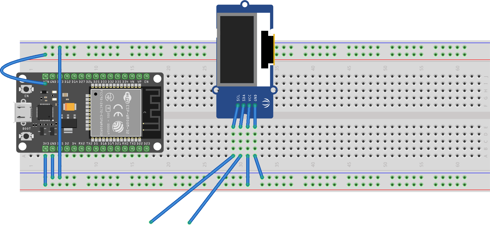

***Individual Assignment***

## Introduction

In this lab, you will learn how to utilize the I2C module built into the ESP32 to control an OLED display with a simple state machine, which you will be able to use on your project.

## Objectives

- To learn and explore the functionality of the ESP32's built in I2C module
- To program the ESP32 using VSCode
- To have a working display that can be used on your semester project

<iframe width="560" height="315" src="https://www.youtube-nocookie.com/embed/DZUFlnxssxw?si=1C33EcU9FcLi6Hbi" title="YouTube video player" frameborder="0" allow="accelerometer; autoplay; clipboard-write; encrypted-media; gyroscope; picture-in-picture; web-share" referrerpolicy="strict-origin-when-cross-origin" allowfullscreen></iframe>

> An **individual** live demonstration is required. You may work in pairs (**one** partner), but must individually demonstrate your working breadboard.

## Parts Needed

| **Item**                | **Quantity** |
| :---------------------- | :----------- |
| ESP32 Development Board | 1            |
| Breadboard              | 1            |
| Jumper wires            | ~10          |
| USB Micro Cable         | 1            |
| OLED Screen             | 1            |

## External Resources


- The [Embedded Systems Resources](https://embedded-systems-design.github.io/) blog
    - [VS Code Setup and Usage](https://embedded-systems-design.github.io/vscode-setup/)
    - [Using the Pymakr Extension in VSCode](https://embedded-systems-design.github.io/using-pymakr/)
    - [Working with Thonny](https://embedded-systems-design.github.io/working-with-thonny/) tutorial
    - other
        - [EGR314 Software Downloads](https://embedded-systems-design.github.io/egr314-software-stack)
        - [ESP32 DevKit Resources](https://embedded-systems-design.github.io/tutorials/esp32/)
        - [Installation instructions](https://embedded-systems-design.github.io/esp32-installation-and-setup/)
- RandomNerdTutorials
    - [Micropython and ESP32 Introduction](https://randomnerdtutorials.com/micropython-programming-basics-esp32-esp8266/)
    - [MicroPython GPIOs](https://randomnerdtutorials.com/micropython-gpios-esp32-esp8266/)
    - [MicroPython Inputs Outputs](https://randomnerdtutorials.com/esp32-esp8266-digital-inputs-digital-outputs-micropython/)
    - [MicroPython Analog Inputs](https://randomnerdtutorials.com/esp32-esp8266-analog-readings-micropython/)
- OLED Screen Information:
    - [Amazon Purchase Link](https://www.amazon.com/Songhe-0-96-inch-I2C-Raspberry/dp/B085WCRS7C/)
    - Micropython Framebuf package
    - Micropython GFX Package
    - Micropypthon SSD1306 Package
    - [gfx.py source](https://raw.githubusercontent.com/adafruit/micropython-adafruit-gfx/master/gfx.py)
- Python resources
    - [Defining Functions](https://learnpython.com/blog/define-function-python/)

## Instructions

1. Clone the ESP32_Oled project to your local pc: <https://github.com/embedded-systems-design/code_esp32_oled>.  Take a look inside.  
    1. Remember that ```boot.py``` and ```main.py``` are the two files that get run automatically
    1. ```import``` loads other files and runs what's inside.
    1. what's inside ```my_oled.py```?
    1. what pins are used for ```SCL``` and ```SDA```?


1. Wire up your OLED to your ESP32, using the pinouts you just discovered.

    

    > **Note:** OLED image is not representative of actual module or pin order

1. Go back to ```main.py```.  At the bottom, create a while loop that continues forever:

        while True:
            pass

    > ```pass``` simply is a line that means "do nothing". You always need something in a ```while``` loop, ```for``` loop or ```if``` statement.

1. at the top of main.py, import the time library:

        import time

1. add a pause inside your while loop:

        while True:
            pass
            time.sleep(1)

    > Now that you have something in the while loop, you can comment out the ```pass``` statement


1. Create an "state" variable that holds states.  Initialize it right before the while loop:

        state = 0

1. Increment the state variable each time you go through the while loop.

        state = state+1

1. Inside the while loop, after incrementing state, if state is equal to 4 or greater, reset it to zero.

1. How do you know if it's working? print the current value of  ```state``` each time it cycles through ```while``` with ```print(state)```.  Put it right below ```while True:```

1. Inside the while loop, if the state is equal to zero, have your program perform the following action:

        my_oled.print_text("test",0,0)


1. Inside the while loop, if the state is equal to one, have your program perform the following action:

        my_oled.print_text("something else",0,0)


1. look at the ```my_oled.py``` file.  See what the ```print_text()``` function does.

    * identify the ```fill(0)``` function.  What does the code say is happening?
    * identify the ```show()``` command.  What does the code say is happening?

1. Modify ```my_oled.print_text("something else",0,0)``` so the text prints on the bottom row of the OLED.

1. Inside the while loop, if the state is equal to 2, have your program perform the following action:

    1. clear the screen
    1. draw a line
    1. show the screen

    > to draw a line, try ```my_oled.oled.line(0,0,10,10,1)```

1. Now, modify your code so that you draw a line from the bottom left of the screen to the top-right of the screen

1. Inside the while loop, if the state is equal to 3, have your program perform the following action:

    1. clear the screen
    1. draw a filled rectangle
    1. show the screen

    > to draw a filled rectangle, consider using the ```my_oled.graphics.fill_rect(0,0,10,10,1)```

1. Now, modify your code so that you draw a filled rectangle that covers the bottom-right quadrant of the screen.
1. Finally, look in the ```lib/gfx.py``` module.  What other functions can you implement?
1. (optional) look inside my_oled to see how ```print_text()``` was implemented.  How could you simplify your while loop by bringing your plotting functions inside the ```my_oled.py``` module?
<!--
1. We need to install new ESP32 libraries.  This will be done by repeating the steps from the [last assignment](/314/314-ind-04-uart-mqtt-communication/), with updated code.
    1. If you already cloned the [esp32 mqtt library](https://github.com/embedded-systems-design/code_esp32_mqtt), navigate to the folder, open it in Git Extensions, and pull the latest version 
-->

<!-- 
    1. Open the "esp32_setup.py" code from the github repository.

        1. Replace the wifi information (variable name "ssid" and "password") with your home router information if testing at home, if necessary, or keep it the same if working in Peralta 103.

            config.ssid = 'photon'
            config.wifi_pw = 'particle'

        1. Run the code on your ESP32.

        > *Note: Assuming your ESP32 has been freshly flashed with micropython, this will connect to the internet, download three libraries, and save them into the file space under the ```lib``` directory on the ESP32 for future use.* 
-->

<!-- 
1. Clone the [esp32 mqtt library](https://github.com/embedded-systems-design/code_esp32_mqtt), navigate to the folder, open it in Git Extensions or VSCode, and pull the latest version.
1. Create a file named "config.py" at the top of the project folder and paste in the following:

        TEAM = 'EGR314/Team321/'
        TOPIC_HB=TEAM+'heartbeat'
        TOPIC_PUB = TEAM+'PUB'
        #TOPIC_SUB = TEAM+'SUB'
        TOPIC_SUB = 'EGR314/Instructor'
        MQTT_SERVER = '52.25.206.167'
        MQTT_USER='student'
        MQTT_PASSWORD='egr3x4'
        WIFI_SSID = 'photon'
        WIFI_PASSWORD='particle'        

    > **Note:** If you want to work from home, replace the wifi information(```WIFI_SSID``` and ```WIFI_PASSWORD```) with your home router information, or keep it the same if working in Peralta 103.

1. Open "main.py" from the local github repository directory in your IDE$^1$
    1. add a line after line 17 (```from config import *```)

            import my_oled

    1. note the two initially commented-out lines in your ```sub_cb(topic, msg, retained, qos)``` function, right after the ```print``` line:

            # my_oled.print_data(msg)
            # my_oled.plot_data(msg)

1. open the file called "lib/gfx.py", paste in the contents from , and save to the esp32 in the ```lib``` directory.
1. Reset the ESP32 by pressing the "en" pushbutton on the device. The device will connect to wifi and then the MQTT server you programmed.  Make sure it runs without error and logs an incoming message when something is published on the indicated MQTT topic.
1. Connect Power, Ground, SCL, and SDA pins of the OLED, making sure the SCL/SDA pins indicated in "my_oled.py" are the same in your code.
1. Open up lib/ssd1306.py on your esp32 and inspect the code, looking for the place where the ```text()``` function is defined.
    1. inspect the arguments this function expects
    1. implement the text function in your empty ```print_data```
1. Let's learn about some of the functionality provided by ssd1306.py and the framebuf library

    - ```oled.fill(0)``` will clear the screen.
    - ```oled.text(string,x,y)``` prints a string variable or literal at position x,y on the screen. (0,0) is considered top left
    - ```oled.show()``` will display once you have drawn everything

1. Implement the text function in your empty ```print_data```.  See the demonstration of proficiency below for the expected display format. Example from class:

        def print_data(msg):

            # convert byte array to string
            my_string = msg.decode('utf-8')
            # split string by spaces
            my_strings = my_string.split(" ")
            # convert string to float
            my_values = [float(item) for item in my_strings]

            # clear screen
            oled.fill(0)

            # iterate through values
            for ii,item in enumerate(my_values):
                # print string on new line
                oled.text(str(item), 0, 10*ii)

            # show screen
            oled.show()  

    > Note the use of ```enumerate()``` which simplifies indexing logic. (added after class)

1. uncomment the ```print_data()``` line in "async_mqtt_uart.py".

1. Open up lib/gfx.py on your esp32 and inspect the code, looking for the place where the ```line()``` function is defined.

    - ```graphics.line(x1,y1,x2,y2,1)``` will plot a line from (x1,y1) to (x2,y2).  (0,0) is considered top left, and the width of the screen is given in my_oled.py as ```oled_width = 128```, and ```oled_height = 64```.

1. Implement the ```line``` function in your empty ```plot_data```. See the demonstration of proficiency below for the expected display format.
    1. comment the ```print_data()``` line in "async_mqtt_uart.py" and uncomment the ```plot_data()``` line in "async_mqtt_uart.py". -->

## Demonstration of Proficiency

<!-- TODO: UPDATE -->

Please be prepared to demonstrate

1. Cycling through states 0,1,2,3 in the terminal
1. Printing text on the top and bottom of the screen
1. Drawing a line from the bottom left to the top right corner of the screen
1. Drawing a filled rectangle in the bottom-right quadrant of the screen.

## Canvas Submission

No canvas submission is required

### Grading

| Item            | Points  |
| :-------------- | :------ |
| Demonstration 1 | 25     |
| Demonstration 2 | 25     |
| Demonstration 3 | 25      |
| Demonstration 4 | 25      |
| **Total**       | **100** |
