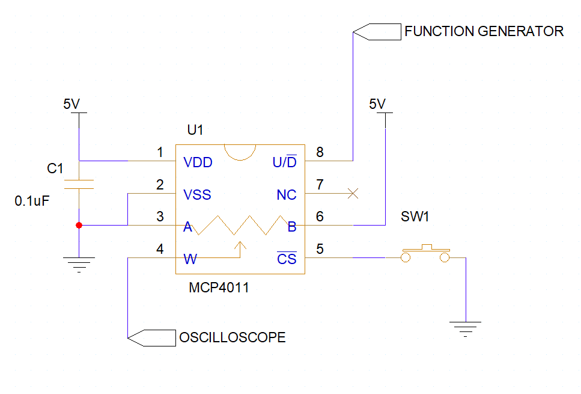

> This assignment is a ***paired in-class checkoff***. An **individual** live demonstration is required. You may work in pairs (**one** partner), but must individually demonstrate your own soldering skills.

## Objectives

In this assignment, you will practice soldering common surface mount packages using a soldering iron and tweezers.  The surface mount chip you solder will then be used in the next in-class checkoff for advanced serial communication using SPI or I$^2$C.

Individually, you must demonstrate proficiency in:

1. Soldering a surface mount IC and surface mount resistor to a PCB
2. Verifying Connectivity from the breadboard to the pins of the surface mount pins

> This In-class checkoff requires advance work in order to complete it within one class period. Please prepare with your team to select the appropriate parts and prepare as much as possible.

Thanks to Zachary for the following video:

<iframe width="560" height="315" src="https://www.youtube.com/embed/pucN5eDQErE" title="YouTube video player" frameborder="0" allow="accelerometer; autoplay; clipboard-write; encrypted-media; gyroscope; picture-in-picture; web-share" allowfullscreen></iframe>

<iframe width="560" height="315" src="https://www.youtube.com/embed/r6oD5bdy6EI" title="YouTube video player" frameborder="0" allow="accelerometer; autoplay; clipboard-write; encrypted-media; gyroscope; picture-in-picture; web-share" allowfullscreen></iframe>

## Bill of Materials

| **Item**                     | **Quantity** | **Details**                                                                                             |
| ---------------------------- | ------------ | ------------------------------------------------------------------------------------------------------- |
| Surface Mount Serial IC      | 1            | Distributed in class; extras in Peralta 109, type determined by your Team / Subsystem needs (see below) |
| Surface mount breakout board | 1            | Distributed in class; extras in Peralta 109, determined by your surface mount IC                        |
| Male header                  | 1            | Provided in class                                                                                       |
| Other Misc Parts             | 1            | Located in Peralta, Determined by your Team / Subsystem needs                                           |

## Surface Mount Serial IC 

You will be working with one of the following devices:

| Part               | Part #          | Digikey URL   | Datasheet          |
| ------------------ | --------------- | ------------- | ------------------ |
| Hall Effect Sensor | AS5600-ASOM     | [link][link1] | [datasheet][link4] |
| Temperature sensor | TC74A4-3.3VCTTR | [link][link2] | [datasheet][link5] |
| Motor Driver       | IFX9201SGAUMA1  | [link][link3] | [datasheet][link6] |
| other$^1$          | tbd             | tbd           | tbd                |

<!--
| Breadboard                   | 1            | From your Fall kit                                                                                      |
| Jumper wires                 | Many         | From your Fall kit                                                                                      |
| Resistors                    | 2            | Determined by your I$^2$C requirements, located in Peralta 109                |
| 0.1 µF 0805 Capacitor        | 1            | Provided in class                                                             |
| Momentary push button                 | 2            |                                                                                                                                                                                      |
| SOIC-package digital potentiometer IC | 1            | Provided in class                                                                                                                                                                    |
| (will be provided in class)           |              | [MCP4011](https://www.digikey.com/en/products/detail/microchip-technology/MCP4011-103E-SN/1015488) ([datasheet](https://ww1.microchip.com/downloads/en/DeviceDoc/20001978D.pdf)) |
-->

## Resources

- [BK Precision Triple-Output 30V, 5A Digital Display DC Power Supply (Model 1671)](https://www.bkprecision.com/products/power-supplies/1671A-triple-output-30v-5a-digital-display-dc-power-supply.html) ([manual](https://bkpmedia.s3.amazonaws.com/downloads/manuals/en-us/1671A_manual.pdf))
- [BK Precision 5 MHz Function Generator (Model 4011A)](https://www.bkprecision.com/products/signal-generators/4011A-5-mhz-function-generator.html) ([manual](https://bkpmedia.s3.amazonaws.com/downloads/manuals/en-us/4011A_manual.pdf))
- External Links
    - [8 Common Errors in Surface Mount Technology (SMT)](https://www.protoexpress.com/blog/common-errors-surface-mount-technology-smt/)
    - [13 Common PCB Soldering Problems to Avoid](https://www.seeedstudio.com/blog/2021/06/18/13-common-pcb-soldering-problems-to-avoid/)
    - [SURFACE MOUNT TROUBLESHOOTING GUIDE](https://www.surfacemountprocess.com/surface-mount-troubleshooting-guide.html)
- External Videos
    - [Removal of Solder Using Solder Wick](https://www.youtube.com/watch?v=htrcZuK_ZsY)
    - [How to Solder Surface Mount parts (it's easy!)](https://www.youtube.com/watch?v=f9fbqks3BS8)
    - [EEVblog #997 - How To Solder Surface Mount Components](https://www.youtube.com/watch?v=hoLf8gvvXXU)

<!--
- [MCP4011 Datasheet](https://ww1.microchip.com/downloads/en/DeviceDoc/20001978D.pdf)
    - Figure 1-1 and Figure 1-2 show timing diagrams
    - Section 4.1 describes how to change the output
-->

## Prior to Demonstration of Proficiency

1. Preheat your soldering iron to 400º C. Note that you may need to increase the soldering iron temperature later if you are not getting good solder joints. Higher heat means you must solder faster to avoid overheating your components.
2. Turn on the fume extractor next to your bench.
3. Mount your breakout board in a vice.
4. Apply flux from the flux pen to all of the pads on the breakout board. Flux serves two main purposes:
    1. It helps clean the pads.
    1. It helps keep the pads free of oxidation which makes soldering more difficult.
5. Without the IC on the board, add solder to one of the surface mount pads (and only one) on the footprint. Which pad would be the best to start with?
6. Align the IC with the pad on the board and solder the pin to the pad you just tinned. Note that this is easier to do if you hold the IC down with a pair of tweezers.
7. Inspect the alignment of the IC with the rest of the pads. It is much easier to make any adjustments now than after you have soldered all of the pins to the board. If the IC is not aligned properly, melt the solder on the pin you soldered and adjust the IC as necessary.
8. After you have verified your pins are properly aligned with the pads, solder the pin opposite to the one you just soldered.

    > Take a look at the links in the resources above for identifying common issues with your board.

9. Inspect your board again for pin alignment. If the IC pins are not perfectly aligned with the pads, try to re-melt the solder and adjust the alignment of the IC.
10. After you are satisfied with the alignment of all the pins, solder the rest of the pins on to the board. There are multiple approaches to doing this shown in the resources above, but the important thing is to make sure that your pins have a good solder joint with the pads. Solder bridges can be fixed, so do not panic if you solder two pins together.
11. Inspect all your solder joints both visually and by checking for continuity between adjacent pins with a DMM (generally they **should not** have continuity between them). If you have bridged pins, you can fix that by cleaning your soldering iron and then heating up the contact between the pad and the pin until the solder flows. You can also put flux on the bridged pins and reheat them with the soldering iron to remove bridges. Any remaining bridges can be cleaned up with solder wick (see above resources).
12. (optional) Identify which pin is VDD and which is VSS. Using tweezers, place a 0.1$\mu$F capacitor between the pins and melt the solder of one pin. After the capacitor is held in place, solder the other end and then go back and add more solder to the first end

    > Note: It is best practice to place a .1 $\mu$F capacitor in close proximity to the power / ground pins of your IC.  For the purposes of this and the next assignment, you may place it close on your breadboard.

13. Solder male to male headers to the board so that it can be plugged into a breadboard.
14. Turn off the soldering iron, making sure to melt some solder onto the tip in order to protect the tip. Note that you should never leave a soldering iron on if you are not using it.
15. Clean your board using isopropyl alcohol. Note that flux is corrosive to copper, so if you do not clean up your board, the flux will eventually eat away your traces.

## Part 2. Individual Demonstration of Proficiency

In class, demonstrate the following **live** to a member of the Teaching Team by the end of class:

1. Your soldered board (each student should solder their own board)
2. Verified continuity to each pin on your surface mount part.

**A live demonstration by the end of class is required. No late demonstrations will be accepted.**

## Canvas Submission

**No Canvas submission is required.**

## Grading

| **Demonstration**                                    | **Points** |
| ---------------------------------------------------- | ---------- |
| 1.  Soldered PCB                                     | 25         |
| 2.  Verified Connections with no shorts to neighbors | 75        |
| **Total**                                            | **100**    |

<!--

16. Attach your newly soldered PCB to your breadboard and wire it up according to the schematic below:

    

17. Attach an oscilloscope probe to the W (wiper) pin on the MCP4011. This is the output of the potentiometer.
18. Set the function generator to a low frequency (<10 Hz) square wave. ([Function generator manual](https://bkpmedia.s3.amazonaws.com/downloads/manuals/en-us/4011A_manual.pdf))
19. Study section 5.2 of the [MCP4011 datasheet](https://ww1.microchip.com/downloads/en/DeviceDoc/20001978D.pdf) to determine how to change the output of the MCP4011. Observe this change on the oscilloscope.

-->

[link1]: https://www.digikey.com/en/products/detail/ams-osram/AS5600-ASOM/4914332
[link2]: https://www.digikey.com/en/products/detail/microchip-technology/TC74A4-3-3VCTTR/443268
[link3]: https://www.digikey.com/en/products/detail/infineon-technologies/IFX9201SGAUMA1/5415542
[link4]: https://ams.com/documents/20143/36005/AS5601_DS000395_3-00.pdf
[link5]: https://ww1.microchip.com/downloads/en/DeviceDoc/21462D.pdf
[link6]: https://www.infineon.com/dgdl/Infineon-IFX9201SG-DS-v01_01-EN.pdf?fileId=5546d4624cb7f111014d2e8916795dea&ack=t
[pullupref]: https://www.ti.com/lit/an/slva689/slva689.pdf?ts=1610914453139&ref_url=https%253A%252F%252Fwww.google.com%252F
[minilec]: https://www.dropbox.com/s/dhweh10xuvj2ofu/Serial%20Communication.pptx?dl=0
