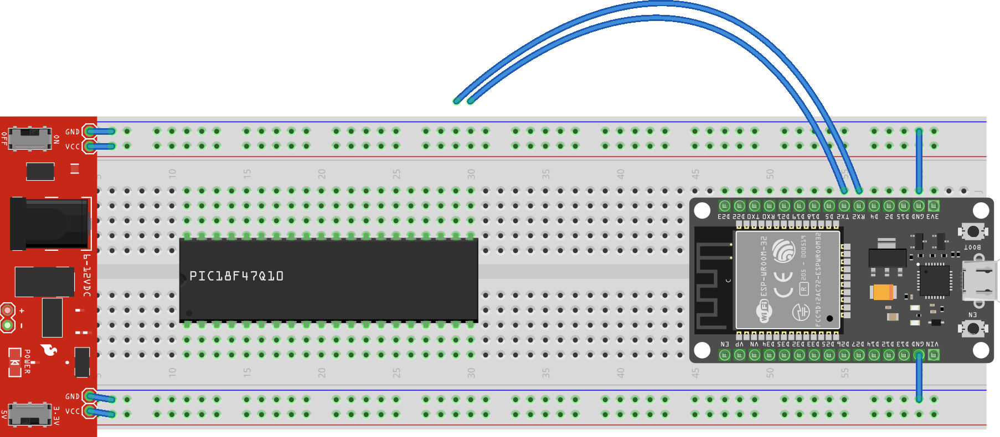

***Individual Assignment***

Thanks to Vishal for the following overview video.

<iframe width="560" height="315" src="https://www.youtube.com/embed/OxmAjbW7bis" title="YouTube video player" frameborder="0" allow="accelerometer; autoplay; clipboard-write; encrypted-media; gyroscope; picture-in-picture; web-share" allowfullscreen></iframe>

> An **individual** live demonstration is required. You may work in pairs (**one** partner), but must individually demonstrate your working breadboard.

## Resources

* [Timers and Interrupts Tutorial](https://embedded-systems-design.github.io/timers-and-interrupts/)
* Canvas Discussion Board

## Prior To the Demonstration of Proficiency

This year we will be using the ESP32 as our serial debugger.  

### Connect the ESP32

1. Mount your ESP32 Wifi Development board on the breadboard. The ESP32 is too wide to expose both rows of header pins for breakout wire, so make sure the side with RX2 and TX2 pins have one row for plugging in breakout wires.

    > Note: This is only required if your ESP32 is not located on the breadboard.  Make sure you document all connections from previous labs (with photos).  **Do not disconnect power or ICSP wires from the PIC!**

    

    ***Note:** This is not a complete wiring diagram.  The PIC18F47Q10 should have all power, ground, and ICSP pins configured as in previous labs.  Additionally, The suggested pins on the PIC can be assigned to any pin of your preference on the DIP package of the PIC18F47Q10, as determined by your MCC configuration.*

1. Connect ground pin(s) of the ESP32 to the  ground plane.
1. Plug the ESP32 into a USB port on your computer.
1. Connect the Rx2 pin of the ESP32 to a pin of your selection on the PIC.  This pin will be your UART's transmit (TX) pin in MCC.
1. Connect the Tx2 pin of the ESP32 to a second pin on the PIC.  This pin will be your UART's transmit (RX) pin in MCC.
1. Clone or download the repository used in Lab 1: <https://github.com/embedded-systems-design/code_esp32_simple_uart_echo>
    1. Load the project in VSCode, and find the PyMakr project window.
    1. Open up a new Python terminal(REPL) in PyMakr
    1. Stop whatever code is running with ```ctrl+c```
    1. Download the project code to your ESP32
    1. Reset the ESP32 to run the code.
    1. Keep the ESP32's terminal (REPL) open, to watch what data comes in.

### Tutorial

Next, please complete the [Timers and Interrupts Tutorial](https://embedded-systems-design.github.io/timers-and-interrupts/)

## Demonstration of Proficiency

*You must complete the demonstration individually, either in office hours or in class if time permits.*

1. Demonstrate the LED state changing once each second.
1. Demonstrate the current time prints over EUSART to Putty
1. Demonstrate that pushing the button increments or decrements the setpoint variable (that is printing over EUSART) by 5% once and only once per button push (correctly implementing the debounce logic from the tutorial).

    > **Note:** You do not need to verify on actual hardware. You may use UART with Putty to verify this behavior.

<!-- 1. Demonstrate the current PWM Duty cycle variable prints over EUSART to Putty. -->

## Grading

| **Demonstration**                                                                  | **Points** |
| ---------------------------------------------------------------------------------- | ---------: |
| Step 1.  Demonstrate 1-sec onboard flashing LED                                    |         25 |
| Step 2.  Demonstrate current time printing over UART to the ESP32                  |         25 |
| Step 3.  Demonstrate interrupt-based increment/decrement to over UART to the ESP32 |         25 |
| **Total**                                                                          |    **100** |

<!-- | Step 3.  Demonstrate Duty cycle printing over UART to the ESP32                    |         25 | -->