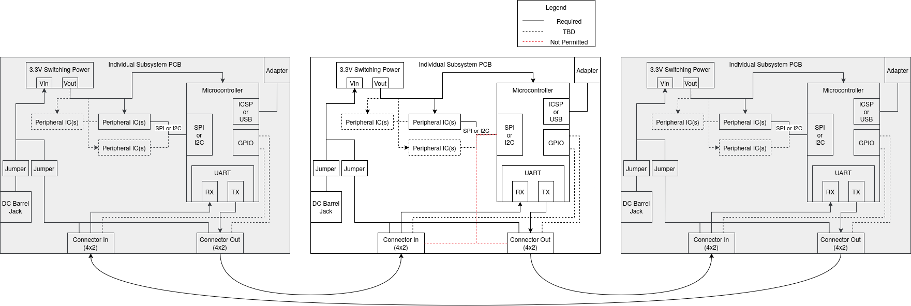
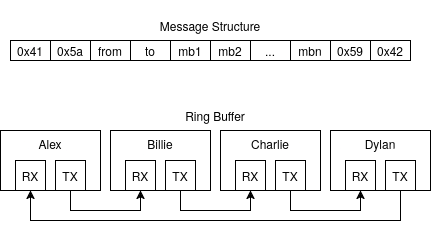
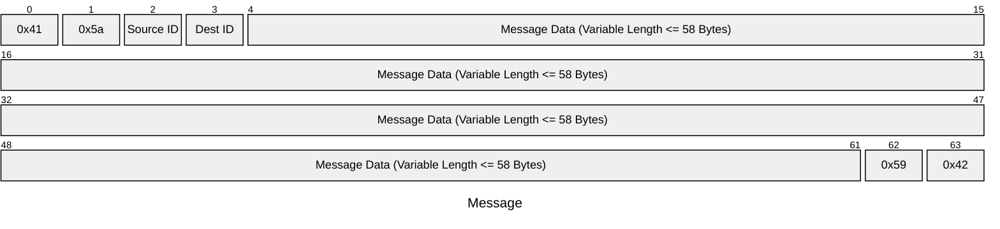

> **Attention:** This is a living document, and will change over the course of the semester, with appropriate notice.

## Daisy Chain Layout

Your team will be communicating over a custom UART daisy chain network as seen above.
All teams will use a 8-wire ribbon cable for power and communication between boards, with a common 2x4 IDC female header connected on both ends.  The following pinouts will be used across all boards.

|             Pin Name |   #   |   #   | Pin Name |
| -------------------: | :---: | :---: | :------- |
| 9-12V External Power |   1   |   2   | UART     |
|                  TBD |   3   |   4   | TBD      |
|                  TBD |   5   |   6   | TBD      |
|                  TBD |   7   |   8   | Ground   |

{style="max-height:200px;"}

It will be your team's responsibility to determine how to use the remaining TBD pins for communicating between upstream and downstream teammates.

> It is not permitted to connect "peripheral" serial networks together between boards.  You may connect microcontrollers together between/across individual teammate PCBs, but it must be seperate from  that which communicates to peripheral chips such as sensors, LCD's, or motor drivers.

### UART Info

| Parameter    | Value     |
| ------------ | --------- |
| Speed        | 9600 Baud |
| Num Bytes    | 8         |
| Parity       | None      |
| Stop Bits    | 1         |
| Flow Control | None      |

### Overview

Each board in the class has a unique ID assigned to it.  If someone wants to send you a packet, they may if they address it to you using your id.  A packet is thus assembled in the following way:  Bytes 1-2 contain a message "prefix".  Byte 3 contains the sender's id.  Byte 4 should be filled with the receiver's id.  The next $M<=58$ bytes contain the the message from the sender to the receiver.  The rest of the packet is filled with those $M$ bytes of data. The last two bytes contain the message "suffix".

Details about the message structure can be seen in the table below

> For all packets, in order for message buffer to equal 64 bytes, $M<=58$.

<!-- 
| Byte 1    | Byte 2      | Byte 3             | Byte 4      | ... | Byte 3+N    |
| --------- | ----------- | ------------------ | ----------- | --- | ----------- |
| Sender ID | Receiver ID | N (Num Data Bytes) | Data Byte 1 | ... | Data Byte N |
 -->

| <!-- | Byte 1 | Byte 2    | Byte 3      | Byte 4         | Byte 5         | Byte 6 | ...            | Byte N-2 | Byte N-1 | Byte N |
| ---- | ------ | --------- | ----------- | -------------- | -------------- | ------ | -------------- | -------- | -------- |
| 0x41 | 0x5a   | Sender ID | Receiver ID | Message Byte 1 | Message Byte 2 | ...    | Message Byte M | 0x59     | 0x42     | -->    |

If you receive a packet addressed to you, you must "dispose" of it after handling its contents by not passing it on downstream.  In this way, all data sent to you terminates with your subsystem and doesn't clog the communication channel.  In this way, if you send a packet that you receive back from your upstream neighbor, you must dispose of it; this either means that you sent a message to someone who is not on your network, or you sent a broadcast message that made it to the whole team.

Your job is thus to program your protocol to handle the following situations:

1. pass along data packets that are not addressed to you
1. handle and dispose of data packets that are addressed to you.
1. handle and pass along data packets that are broadcast to everyone.
1. ensure prioritization between data received, and data your board wants to send.
1. handle data packets that are sent from you but not disposed of by anyone else.

### IDs

Each board in the class has a unique ID assigned to it.  If someone wants to send you a packet, they may if they address it to you.  Byte 3 of the packet should be filled with the sender's id.  Byte 4 in the packet should be filled with the receiver's address.

#### Broadcast ID

If you send to a an address of 0x58 ('X'), this is reserved as a broadcast address.  Your subsystem is required to both handle the packet as well as pass it along downstream. If you were the sender of the packet, it is your job to dispose of the packet once you receive it.

## Receiving Data

Any data you receive must be processed for either

* handling by you
* passing to your downstream teammate
* doing both of the above

> received data always gets priority over data you wish to send

## Sending Data

### Priority

* If there are no packets in your queue to send, you may transmit a packet

> Received data always gets priority, it is thus your responsibility to send received data first.

> It is also your responsibility to schedule sending packets such that there is sufficient bandwidth for others to send their data as well.
>

## Sending Bad Data

You must carefully consider how you form packets, to ensure the following cases:

* You don't accidentally form messages that contain either packet prefixes or suffixes.  Padding data can help
* ...

## Receiving Bad Data

It is your responsibility to handle mal-formed packets in the following way:

| Case                                                                                                                  | Action                                   |
| --------------------------------------------------------------------------------------------------------------------- | ---------------------------------------- |
| characters transmitted before a message prefix                                                                        | ignore                                   |
| characters transmitted after a message suffix                                                                         | ignore                                   |
| messages from someone else that are larger than 64 bytes _or_   messages without a proper terminating character. | _do not transmit  _ stop storing. |
| Addresses from somebody unexpected                                                                                    | do not transmit                          |
| Addresses to somebody who is not there                                                                                | do not transmit                          |
| ...                                                                                                                   | ...                                      |

## Timing and Size limits

It is critically important that you consider message size and frequency in your protocol design.  If your team sends more data than the UART system can handle, unintended consequences can occur, like buffer overflows, loss of data, etc  For example, here is a thought experiment

| Name               | Value                                               |
| ------------------:| --------------------------------------------------- |
| Baud Rate          | 9600 Bits per Second                                |
| Bits per Byte      | 8                                                   |
| Num Prefix Bytes   | 4                                                   |
| Num Suffix Bytes   | 2                                                   |
| Message Data Size          | N (this is up to you)                               |
| Bytes Per Message  | Data Size + (Num Header Bytes) + (Num Footer Bytes) |
| \# Team Members    | 4                                                   |

Messages Per Second = (Baud) / (Bits per Byte) / Bytes per Message / (\# Team Members)  
Messages Per Second = $\frac{Baud}{BitsPerByte*(prefix+suffix+N)*(\#team)))}$  
Messages Per Second = $\frac{9600}{8*(6+N)*4)}$  

With N=4, this works out to ~ 30Hz.  
With N=30, this works out to ~ 8Hz.  

Given this theoretical maximum, it will be important to send data _much_ slower than this for debugging (at 1/4 to 1/10 the absolute maximum) until your code is optimized.

> This protocol will not be sufficient for high-speed controllers
