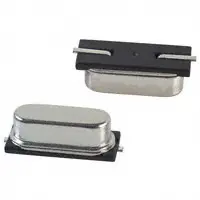

***Team Assignment***

## Objectives

To identify, compare, and contrast multiple solutions for subsystem, and articulate a rationale for your final choices. Once everyone has made a rationale for major components the team will make one team [Bill of Materials](https://www.dropbox.com/s/urnlk2rn0xu6hih/Bill%20of%20Materials%20Example.xlsx?dl=0). Once the BOM is made then submit an [Order form](https://www.dropbox.com/sh/0pu5curaf0s2bs8/AAC_PwZxVOF_R2ny7IMxwVjea?dl=0) to PolyBizz (polybizz@asu.edu) Only one person on the team will submit the purchase form. Please CC your entire team the Instructor and the teaching team in this email if changes need to be made you are responsible for making any changes PolyBizz requests.

## Resources

* [Example Power Budget](https://www.dropbox.com/s/wyeqisp0uzyiics/Power%20Budget%20Example.xlsx?dl=0)
* [Ordering Resources](https://www.dropbox.com/sh/0pu5curaf0s2bs8/AAC_PwZxVOF_R2ny7IMxwVjea?dl=0) folder
* [Sources pages](https://embedded-systems-design.github.io/tags/sources/) on the Embedded Systems Design Resources blog
<!-- * [Microcontroller Selection Table Template](https://www.dropbox.com/s/s3i811svmioq3g1/microcontroller-selection-table.docx?dl=0) -->

* Canvas Discussion Board

## Assignment

In this written assignment, you must identify, compare, and contrast multiple solutions for every major component in your design. Major components include every major component in your subsystem in the team block diagram, and any major mechanical parts.

Your assignment should consist of the following parts:

1. **Major component selections** - For each block in your block diagram and major mechanical components, you must research the following:
    
    Create *separate* tables (see [example](#part-table-example) later in this document) describing *at least* **3 potential solutions** for each major component in your subsystem describing **multiple** pros and cons of each solution. You should also consider your project specifications when writing pros and cons.

    > **EGR 314:** All components (except for headers and connectors) must be surface mount. For resistors and capacitors, size 0805 or larger is recommended. Exceptions allowed with prior approval from your professor.

    Each commercial option *must include a photo and a link* to the product, along with unit cost. *Do not paste a plain hyperlink*. Instead, create a link with short descriptive text (like [this link](https://en.wikipedia.org/wiki/Hyperlink)).

    > ***Notes:*** The embedded systems design website has a number of recommended [sources for components](https://embedded-systems-design.github.io/tags/sources/). **Do not select parts from Amazon** unless they come with datasheets or at a very minimum detailed specifications (required for proper design).

    Then, choose the optimal solution for your design and provide rationale for why your choice is optimal. Your rationale should be strong (e.g., avoid rationale such as "I chose this part because it's the first one on Google that met our specifications"). See [example in Table 1](#3dy6vkm) below.

1. **Bill of Materials** - The team will work together to create one BOM 
    
    Each person must add their Subsystem Components 

    > **EGR 314:** All components (except for headers and connectors) must be surface mount. For resistors and capacitors, size 0805 or larger is recommended. Exceptions allowed with prior approval from your professor.

    Each commercial option *must include a photo and a link* to the product, along with unit cost. *Do not paste a plain hyperlink*. Instead, create a link with short descriptive text (like [this link](https://en.wikipedia.org/wiki/Hyperlink)).

    > ***Notes:*** The embedded systems design website has a number of recommended [sources for components](https://embedded-systems-design.github.io/tags/sources/). **Do not select parts from Amazon** unless they come with datasheets or at a very minimum detailed specifications (required for proper design).

    Then, choose the optimal solution for your design and provide rationale for why your choice is optimal. Your rationale should be strong (e.g., avoid rationale such as "I chose this part because it's the first one on Google that met our specifications"). See [example in Table 1](#3dy6vkm) below.

<!-- 3. **Source Parts:** You will be building 2 - 3 iterations of your design: individual subsystem boards and a final team board. Therefore, you need to order **at least** 2 sets of parts to build all of the circuits in your design, plus extras in case parts get damaged during prototyping. See the Ordering Resources folder linked above for more information. -->

## Homework Preparation and Submission

This work will be used -- and graded -- in multiple ways. It will be checked for completeness on the date given in Canvas.

### Preparation

Please prepare this assignment as a new page on your github webpage   Once completed,

* [x] Create a link to this new page on your website
* [x] Check the link to ensure that it works
* [x] export this new page as a pdf

> The new page representing your assignment should not present as a page of links.  Do not use it to link to other documents *especially living documents*, such as google docs, draw.io drawings, or google sheets.    Rather, contents from other documents should be exported, saved in your repository, and hosted natively in markdown (or if need be html) in the page itself.

### Submission

To submit a complete assignment, please submit:

* [x] A working URL to the new component selection page.
* [x] the **exported PDF** for easier review

Both items must be submitted, by the deadline in the Canvas course calendar, in order to receive full credit.  It is your responsibility to ensure that your submission to Canvas was successful. Late Canvas submissions will be graded per the policy in the syllabus.

## Grading

| **Item**                          | **Points** |
| :-------------------------------- | ---------: |
| Initial Submission (completeness) |         25 |
| Confirmation email(screenshot)    |         25 |
| **Total**                         |     **50** |

### Completeness

The initial assessment of this assignment (on the due date in Canvas) will be for completeness.  Thus, no credit will be awarded for assignments not submitted -- or submitted incorrectly -- to Canvas.

### Qualitative Assessment

This document will assessed for quality by the teaching team.  Before then, please engage with the teaching team during office hours and/or classtime to review this document for ways to improve it.  We are happy to provide feedback, which will be your responsibility to integrate and address before the external design review.

### Subsequent Uses of this Document

 This document should be updated and improved throughout the semester in order to reflect your most current design.
This document will be used by your team to coordinate team-level decision-making, communication, and software development.
It will also be reviewed seen by external reviewers who will be given the opportunity to provide direct and indirect feedback, and as part of your team's final report.

### Most Common Mistakes

* Selection Rationale missing pros/cons

## Examples <a id="part-table-example">

*Table 1: Example component selection*

**External Clock Module**

| **Solution**                                                                                                                                                                      | **Pros**                                                                                      | **Cons**                                                                                            |
| --------------------------------------------------------------------------------------------------------------------------------------------------------------------------------- | --------------------------------------------------------------------------------------------- | --------------------------------------------------------------------------------------------------- |
|  Option 1.  XC1259TR-ND surface mount crystal $1/each [link to product](http://www.digikey.com/product-detail/en/ECS-40.3-S-5PX-TR/XC1259TR-ND/827366) | \* Inexpensive[^1] \* Compatible with PSoC \* Meets surface mount constraint of project | \* Requires external components and support circuitry for interface \* Needs special PCB layout. |

| **Solution**                                                                                                                                                                                      | **Pros**                                                                                                                                    | **Cons**                                    |
| ------------------------------------------------------------------------------------------------------------------------------------------------------------------------------------------------- | ------------------------------------------------------------------------------------------------------------------------------------------- | ------------------------------------------- |
|  \* Option 2.  \* CTX936TR-ND surface mount oscillator  \* $1/each  \* [Link to product](http://www.digikey.com/product-detail/en/636L3I001M84320/CTX936TR-ND/2292940) | \* Outputs a square wave  \* Stable over operating temperature   \* Direct interface with PSoC (no external circuitry required) range | * More expensive  \* Slow shipping speed |

**Choice:** Option 2: CTX936TR-ND surface mount oscillator

**Rationale:** A clock oscillator is easier to work with because it requires no external circuitry in order to interface with the PSoC. This is particularly important because we are not sure of the electrical characteristics of the PCB, which could affect the oscillation of a crystal. While the shipping speed is slow, according to the website if we order this week it will arrive within 3 weeks.

[^1]: Avoid the word "cheap". "Cheap" means poor quality, while "inexpensive" means affordable.

## Most Common Mistakes

*Major Component Selection*

Do not...

1. Choose components or modules without data sheets. In most cases, trying to design with a component that doesn't have a data sheet is excruciatingly difficult and may significantly increase the time to complete a project.
2. Choose components that are too small to solder easily. Use QFN and smaller IC packages (common for accelerometers) at your own risk.
3. Only list 1 pro or con for a particular device. The goal is to thoroughly research all of the pros and cons of a device so that you can make an informed decision.
4. Use only 1 word to describe each pro/con.
5. Select a USB power pack as your power source.

*Microcontroller Selection Mistakes*

Do not...

3. Choose ICs that are too small to solder easily. Avoid [BGA](https://en.wikipedia.org/wiki/Ball_grid_array), [QFN](https://en.wikipedia.org/wiki/Quad_Flat_No-leads_package), and [flip chips](https://en.wikipedia.org/wiki/Flip_chip)/[dies](https://en.wikipedia.org/wiki/Die_(integrated_circuit)) (see [Common PCB Footprints](https://www.dropbox.com/s/ixg73lw0w80j5wg/PCB166FootprintsV2.pdf?dl=0)) as they are too small to manufacture and solder in Peralta. According to the [Peralta PCB Mill Specs](https://peraltastudios.engineering.asu.edu/pcb-mill-specs/), footprint pads cannot be smaller than 20 mil, 0.020 in, 0.51 mm and the pin pitch (distance from the center of one pin to the center of the next) of a component cannot be smaller than 31.5 mil, 0.0315 in, 0.80 mm.

<!--
2. (**optional**) On the Microchip webpage for your chosen microcontroller, look for a link to see the Development Boards for your microcontroller. Development Boards give you a known working hardware platform to experiment with, and are particularly useful for coding while you are still bringing your custom hardware platform up. Once you find the full part number for your development board (e.g., DM164136), [call*** *(don't email) the main Microchip Arizona Global Sales & Distribution office](https://www.microchip.com/salesdirectory/SalesListing/UNITED%20STATES/Arizona) and briefly explain that you're a student at ASU, describe your project, and politely ask whether they might be able to send you the development board that you need.
-->

## Frequently Asked Questions

*Major Component Selection*

**Q:** Can we use USB power packs?  
**A:** In general, no. Your system requires the use of a linear voltage regulator and USB power packs are already regulated to 5V. If you have multiple systems in your design (e.g., a wrist band and a separate device elsewhere) you could potentially use a USB power pack for one of them and still meet the course requirements. See your professor to discuss options.

*Power Budget*

## Checklist

* [x] Multiple candidates (3 min) considered per peripheral
* [x] Pictures and Links are  present and up-to-date
* [x] Multiple, plausible pros and cons are listed for each of the major component selections
* [x] Clear rationale is provided for the selection of all major components
* [x] Overall Component Selection is up-to-date and reflects the current direction of the team
* [x] Microcontroller table is included and complete
* [x] Pin Table is included and complete
* [x] Power budget uses the provided template
* [x] Power budget lists all power supplies, their voltages, and how much current they can source
* [x] Power budget lists all devices that use power, what voltage they use, and how much current they use
* [x] Power supply has a 25% current safety margin over the maximum calculated operating current

<!-- old templatte: <https://www.dropbox.com/s/s3i811svmioq3g1/microcontroller-selection-table.docx?dl=0  > -->

  [template]: https://embedded-systems-design.github.io/template_report/pic-table/
  [esp-template]: https://embedded-systems-design.github.io/template_report/esp-32-table/
  [esps3digikeylink]: https://www.digikey.com/en/products/detail/espressif-systems/ESP32-S3-WROOM-1-N4/16162639
  [esp32datasheet]: https://www.espressif.com/sites/default/files/documentation/esp32-s3-wroom-1_wroom-1u_datasheet_en.pdf
  [esp32devkit]: https://www.amazon.com/ESP-WROOM-32-Development-Aideepen-Compatible-MicroPython/dp/B0BQJ8BTVB
