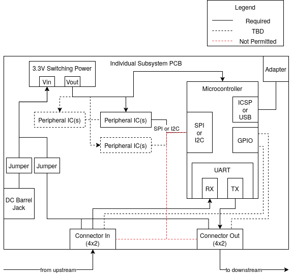
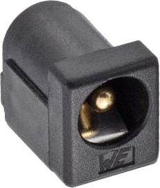
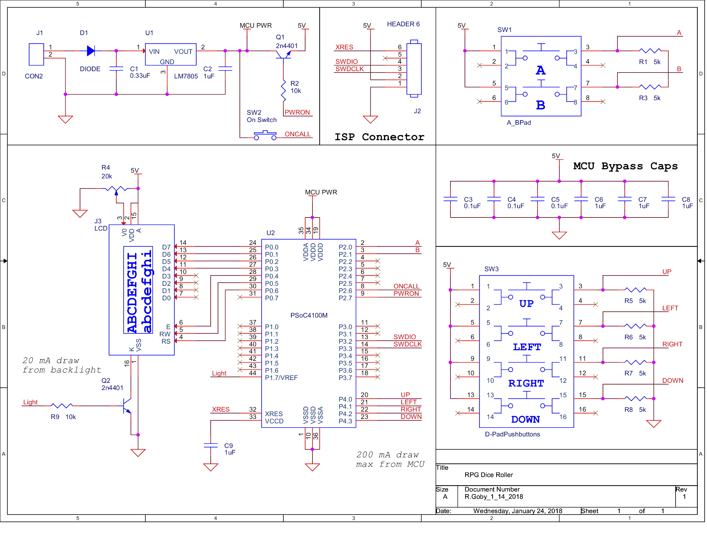
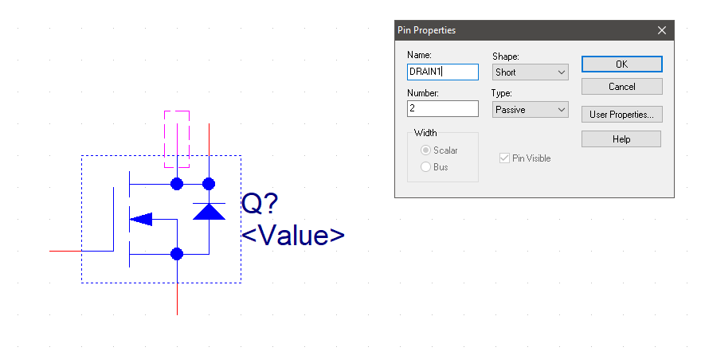

> **This is an individual homework assignment** but you may work with others to determine how to complete the assignment.  Your team's project assignments should inform the approach you take.

## Objectives

The purpose of the individual **Schematic Design**,  is to complete a schematic using an EDA tool such as Cadence, Altium, Xpedition, or Kicad.

1. **Schematic Design:** Schematic design and creation

In the **Schematic Design** assignment, you will create a schematic for your individual subsystem as determined with your team for your team project and shown in your team block diagram assignment. This may be heavily adapted from one of the circuits you created in prior assignments, or designed fresh, based on your team's product requirements.

You must individually demonstrate proficiency in using ECAD software (Electrical Computer-Aided Design) to create a schematic for the subsystem(s) you are responsible for in the project

<!-- 
1. Using KiCad or Cadence printed circuit board (PCB) layout software to create a custom PCB layout. 
1. Submitting a validated PCB design for manufacture using an [LPKF ProtoMat S63 Printed Circuit Board Mill](https://www.lpkfusa.com/datasheets/prototyping/s63.pdf).
-->

> In this project you are permitted to use either KiCAD, Altium, Xpedition or Cadence. Everyone on your team must use the same ECAD software so discuss with your team which tool you will use.
>
> * KiCad is an open-source, cross-platform tool that is lighter-weight and a smaller download.
> * Cadence is a professional-level industry-standard tool that takes time to download (~15 GB), install (>1 hour), and learn. *Please plan accordingly*.

## Resources

* Scherz, P., & Monk, S. (2016). [Practical electronics for inventors, fourth edition.](https://www.amazon.com/Practical-Electronics-Inventors-Fourth-Scherz/dp/1259587541/ref=sr_1_1?s=books&ie=UTF8&qid=1470699914&sr=1-1&keywords=practical+electronics+for+inventors+4th+edition) New York: McGraw Hill. ISBN: 978-1259587542 *(**many** circuit design resources)*
* [Ordering Information](https://www.dropbox.com/sh/0pu5curaf0s2bs8/AAC_PwZxVOF_R2ny7IMxwVjea?dl=0) folder
* [Example Schematic](https://www.dropbox.com/s/ixg2uu3bmf9254d/GameControllerV2.pdf?dl=0)
* [Video Walkthrough of (similar previous) Assignment](https://youtu.be/B46Mo9aK-qY)
* Cadence
    * [Summary of PCB Design Steps](https://embedded-systems-design.github.io/pcb-tutorial-notes/)
    * [Cadence posts](https://embedded-systems-design.github.io/cadence) on the Embedded Systems Design Resources blog
    * [Measurement in Cadence PCB Editor](https://embedded-systems-design.github.io/measurement-in-cadence-pcb-editor/)
    * Book: [Complete PCB Design Using OrCAD Capture and PCB Editor](http://search.ebscohost.com.ezproxy1.lib.asu.edu/login.aspx?direct=true&db=nlebk&AN=249296&site=ehost-live&ebv=EB&ppid=pp_iii)
* KiCad
    * [Kiad posts](https://embedded-systems-design.github.io/kicad/) on the Embedded Systems Design Resources blog
* Manufacturing Requirements
    * [Peralta PCB Mill Specs](https://peraltastudios.engineering.asu.edu/pcb-mill-specs/)
    * [Trace Width Calculator](https://www.4pcb.com/trace-width-calculator.html) from Advanced Circuits
    * [Peralta 109 Design for Manufacturing Checker](https://peraltastudios.engineering.asu.edu/wp-content/uploads/2021/08/dfmchecker.html)
* Hardware Information
    <!-- * [ESP32](https://embedded-systems-design.github.io/overview-of-the-esp32-devkit-doit-v1/) -->
    * ESP32-S3 (pre-purchased)
        * ESP32-S3-WROOM-1-N4](surface mount version) [Digikey][esps3digikeylink] / [datasheet][esp32datasheet]
        * [ESP32 S3 Datasheet](https://espressif.com/documentation/esp32-s3_datasheet_en.pdf) (Has more detail on functions)
        * ESP32 S3 [Technical Reference Manual](https://espressif.com/documentation/esp32-s3_technical_reference_manual_en.pdf) (Has details on I/O multiplexing, USB, and others)
    * Vertical Thru Hole USB connector (pre-purchased) ([digikey](https://www.digikey.com/en/products/detail/gct/USB3131-30-0230-A/9859642) / [datasheet](https://gct.co/files/specs/usb3131-spec.pdf)) / [footprint info](https://gct.co/files/drawings/usb3131.pdf)
    * [OLED](https://www.amazon.com/Teyleten-Robot-Display-SSD1306-Raspberry/dp/B0CN373JF4)
  
        
        * related parts
            * [Cable](https://www.amazon.com/gp/product/B00E9P0F34?smid=A64W1E1ZZHST0)
            * [IDC Connectors](https://www.amazon.com/gp/product/B0BVHMTY5S?smid=A19TVI3M6WFVG7)
            * [Pre-made cables](https://www.amazon.com/gp/product/B07DFBPZLJ?smid=A64W1E1ZZHST0)
* Canvas discussion board

## Instructions    

*Complete all of the steps below prior to submitting your assignment to Canvas.*

1. Study the following critical information and concepts:
    1. What is schematic capture? See the [*What is Cadence?*](https://embedded-systems-design.github.io/what-is-cadence/) and [*Cadence Schematic Tutorials*](https://embedded-systems-design.github.io/cadence-schematic-tutorials/) pages for an overview of the software product and its features.  
    <!-- TODO: add KiCAD links -->
1. **Install and configure KiCAD or Cadence** by following the instructions on the Embedded Systems Design website ([cadence](https://embedded-systems-design.github.io/installing-cadence/)| kicad) <!--todo:finish-->
    1. **Learn** how to enter a schematic into KiCAD or Cadence using the tutorials on the Embedded Systems Design website ([cadence](https://embedded-systems-design.github.io/cadence-schematic-tutorials/) | kicad).
   <!-- TODO: add kicad links -->
1. **Create a schematic** of your individual subsystem (as identified in your team block diagram assignment) for the project. Make sure to include the following as it pertains to your subsystem:

    <!---->

    * **Microcontroller:**
        * You must use an ESP32 microcontroller
        * You must select a **surface-mount** version.
        * 0.1 µF [*bypass capacitors*][bypass-caps] on **every** power pin between power and ground (unless otherwise specified in the datasheet).
        * Extra headers to support unexpected PCB modifications.
        * Any other external support components (surface mount only) specified in your microcontroller's datasheet.
        * connection from your team's upstream UART pin to the RX pin of your microcontroller.
        * connection from your the TX pin of your microcontroller to your team's downstream UART pin.
        * ESP32-specific
            * We suggest the ESP32-S3-WROOM or ESP32-WROOM surface mount module
            * specific pin configurations that enable USB programming
            * USB micro connector
    * Power
        * A switching regulator
        * Must accept a range of inputs from 9V-12V
        * must output 3.3V
        * must be a surface mount component
        * Support components, as required by the voltage regulator datasheet, must also be surface mount.
        * A power connector (e.g., a through-hole barrel jack) so you can connect an external power supply to the board. { style="max-height:100px;"}
        * jumpers that can be configured to accommodate two modes:
            * power supplied directly to the board using the barrel jack
            * power supplied directly to the board from your team's ribbon cable.
        * removable fuse, sized for your power needs, with receptacle (can be through-hole)
    * Serial Peripherals
        * candidates
            * A surface-mount sensor or motor driver (daughter boards permitted only with written approval from instructor)
            * An OLED (provided in class)
        * 0.1 µF [*bypass capacitors*][bypass-caps] on **every** power pin between power and ground (unless otherwise specified in the datasheet).
        * Must use a serial protocol to communicate (SPI / I2C recommended)
        * Pullup resistors (for I2C communication)
        * Receptacles, plugs, connectors for all off-board components (motors, sensors)
        * Any necessary signal conditioning, interfacing, or driver circuitry (surface mount components only).  Some examples include:
            * back-emf diodes for motors (if required)

1. **Review your schematic against the Most Common Mistakes at the bottom of this document. This is very important and will save you debugging time later in the semester.**
1. Breadboard and test any parts of your design that you are able to prior to finalizing your schematic.

## Homework Preparation and Submission

This work will be used -- and graded -- in multiple ways. It will be checked for completeness on the date given in Canvas.

### Preparation

Please prepare this assignment as a new "schematic" page on your github webpage 

* [x] Follow the [*Packaging a Cadence Schematic Project for Submission to Canvas*](https://embedded-systems-design.github.io/packaging-cadence-files-for-submission/) instructions to create a PDF and ZIP archive (including the .OLB library files) of your project.
* [x] **Also** save the schematic as a .jpg or .png
* [x] On the new webpage, ensure that the schematic image is visible
* [x] Create a link to the pdf and .zip file below the image, for high-resolution visibility
* [x] Upload the .zip, .pdf, and image along with your new markdown page to your personal github "datasheet" site

  Once completed,

* [x] Create a link to this new page on your individual datasheet's main landing page.
* [x] Check all links to ensure that they work
* [x] export the new schematic page as a pdf

> Do not link to *living documents*, such as google docs, draw.io drawings, or google sheets.   Rather, contents the .pdf and .zip documents should be exported, saved in your repository, and hosted on the github site itself.

### Submission Information

To submit a complete assignment, please submit:

* [x] the zip file for your EDA project
* [x] the pdf of your schematic
* [x] A working URL to the new "schematic" page.
* [x] the **PDF of the webpage** for easier review

## Grading

| **Item**                          | **Points** |
| :-------------------------------- | ---------: |
| Canvas Submission  |         50 |
| **Total**                         |    **50** |

## Example Schematic

{ style="max-height:100px;"}

## Frequently Asked Questions

**Q:** I need help with Cadence! When are your office hours?  
**A:** See Canvas for up-to-date information on office hours.

**Q:** It is difficult to create a schematic without crossing wires. Is it OK if wires cross as long as they do not connect?  
**A:** Wires can cross in a schematic, but there are best practices for making schematics look professional. See the [Keeping a Schematic Tidy](https://embedded-systems-design.github.io/keeping-a-schematic-tidy/) blog entry and/or stop by office hours.

**Q:** If my subsystem is connecting to another team member's subsystem via one or more pins, should I leave those pins empty?  
**A:** At this point, it is best to connect the necessary pin(s) to header pins so that you have a way to physically interface subsystems during future testing.

**Q:** How do you increase the size of the toolbar in Cadence?  
**A:** Experiment with the compatibility settings in Windows. Right click on Orcad Capture Lite, select "Open file location". The program directory will pop up. Right click on the icon for Orcad Capture light, and select "properties"(1). Go to the compatibility tab and select "DPI settings"(2). Try playing with settings (3) and (4).

**Q:** When pulling up libraries when first starting to create a custom schematic symbol, custom library is not coming up as an option. How do I get my custom library to come up?  
**A:** You can create a custom library folder by choosing "File > New > Library". This will create a new library with a default name under Design Resources in the project.

{ style="max-height:100px;"}

Once you have the custom library created, right-click on the library and choose "New Part".    

---

**Q:** I get this error, how do I fix it?     

> *Duplicate Pin Name "DRAIN" found on Package IRF520 , Q1 Pin Number 4: SCHEMATIC1, PAGE1 (4.90, 2.30). Please renumber one of these.*

**A:** Select the part, then right click on it and select "Edit Part". If you double click on each of the top two pins, you will see that they both have the name set to "DRAIN". Change the names so that they do not match. For example, "DRAIN1" and "DRAIN2":{ style="max-height:100px;"} { style="max-height:100px;"}

  [picdatasheet]: https://ww1.microchip.com/downloads/en/DeviceDoc/PIC18F27-47Q10-Data-Sheet-40002043E.pdf
  [bypass-caps]: https://embedded-systems-design.github.io/bypass-capacitor-basics/
  [snap]: https://ww1.microchip.com/downloads/en/DeviceDoc/MPLAB%20Snap%20In-Circuit%20Debugger%20IS%20DS50002787A.pdf
  [esps3digikeylink]: https://www.digikey.com/en/products/detail/espressif-systems/ESP32-S3-WROOM-1-N4/16162639
  [esp32datasheet]: https://www.espressif.com/sites/default/files/documentation/esp32-s3-wroom-1_wroom-1u_datasheet_en.pdf
