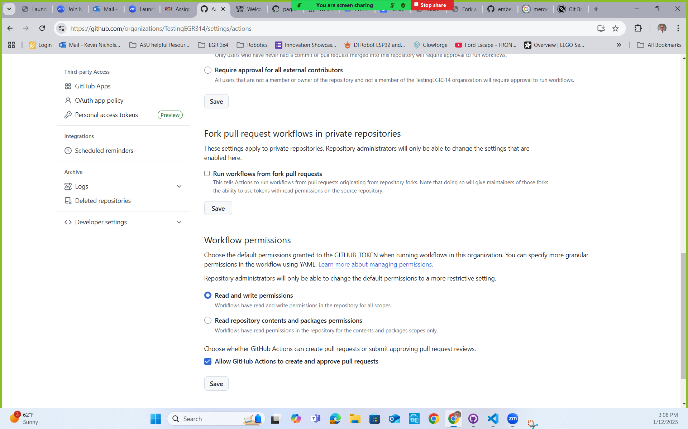
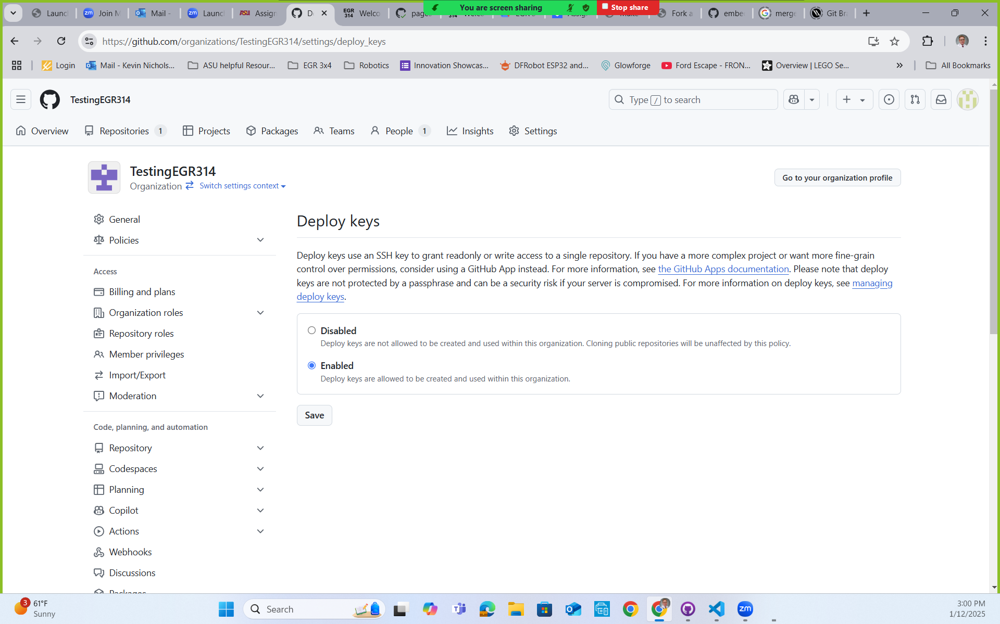

***Team Assignment***

## Objective

The main objective of this assignment is to establish the foundation for team's GitHub Website report. As a team, you will create and develope a repository that with help establish who the team is and what it stands for.

<!--
Establishing your team requires a common understanding of and agreement to the principles and practices that will guide your interactions this semester. Going through an initial team meeting to discuss and decide upon the following points can help to resolve problems later in the semester. Through experience, we have qualitatively observed that teams which spent time on this assignment did better overall.

As a team, you should develop responses for each of the sections outlined below. If you feel that other information should be included in your charter, you may do so. Plan an initial team meeting with all team members present and participating to complete this assignment.
-->

Other objectives:

* To develop a virtual collaboration space for your team to share design documents
* To create a living project report document in Github and populate it with deliverables for grading.
* To present your project in its current form
* To get detailed feedback on your team's progress.

## Resources
* How to fork the report repository(tutorial): <https://embedded-systems-design.github.io/fork-report-website/>
    * Report Template repository link: <https://github.com/embedded-systems-design/template_report>
* Video Tutorials
    * [Video overview for individuals](https://www.youtube.com/watch?v=ZeT1-DjvlUY)
    * [Setting up organizations](https://youtu.be/SgWRyKJ6bGE) to work with the report template
    * [triggering that first build](https://youtu.be/8EgFkG2HHxM)
* Markdown
    * <https://docs.github.com/en/get-started/writing-on-github>
    * <https://github.com/adam-p/markdown-here/wiki/Markdown-Cheatsheet>
    * [pandoc](https://pandoc.org/), a useful tool for converting documents of all kinds
    * [Markdown - Links](https://www.w3schools.io/file/markdown-links/)
* Git
    * Using GitHub to Mangage Project Files(Overview with other tutorials): <https://embedded-systems-design.github.io/using-github-to-manage-project-files/>
        * [accompanying slides](https://www.dropbox.com/scl/fi/wvwpl7a3z245bss8f0rpx/Git-Basics.pptx?rlkey=lx3nanzildd4rot6v4vgx58bu&st=7786szs6&dl=0)
    * <https://learn.microsoft.com/en-us/devops/develop/git/what-is-git>
    * <https://en.wikipedia.org/wiki/Git>
    * <https://www.git-scm.com/book/en/v2/Getting-Started-What-is-Git%3F>
    * (older) Make a Project Repository and Website: <https://embedded-systems-design.github.io/make-a-website/>
* Mission Statement Articles
    * [https://www.productplan.com/glossary/product-mission/](https://www.productplan.com/glossary/product-mission/)
    * [https://www.productplan.com/learn/product-mission/](https://www.productplan.com/learn/product-mission/)
* Contact Information and Weekly Schedule Template: <https://www.dropbox.com/s/ucr49ujowc9rkb2/Contact%20Information%20and%20Weekly%20Schedule.xlsx?dl=0>
* O'Hara, C. (2014). What new team leaders should do first. *Harvard Business Review*. [https://hbr.org/2014/09/what-new-team-leaders-should-do-first](https://hbr.org/2014/09/what-new-team-leaders-should-do-first)

## Instructions

### GitHub-based Project Organization, Repository, and Website

1. One of your teammates should then create an **organization** for your team on github

    > Your team's organization name should be of the format "ASU-EGR314-\<YYYY\>-\<S or F\>-<team#>", as in ```EGR314-2025-S-201```.

    1. Add each of the teammates' github usernames to the organization.
    2. Within the Github Organization setting, check the "Action" settings to make sure that under "Workflow permissions," the "Read and Write permission" and "Allow GitHub Actions to creat and approve pull requests" are selected.
    
    3. Within the Github Organization setting, check that the "Deploy keys" is "Enabled.
    

2. Create a new **public** repository for the team using the same naming format as you did for your personal profile, eg  ```<your-team-org-name>.github.io```.  

    1. You may create it from the course template, found [here](https://github.com/embedded-systems-design/template_report). This will help you get started with different stuff like a welecome page, Table of Contents navigation, and how to add charts.

    > **Note:**  The naming convention of this repository must be followed exactly, or Github will not recognize it as a "github pages" repository

    2. Set it up for serving web pages as you did before.
    3. Add all the organization's members to the repository with "write" access.
> You should write and publish your report on github using markdown.  Do not publish links to .pdf files.

### Initial Website Content

The purpose of this report website is to have one complete and comprehensive website for all your team's assignments. Each section of the main body of the website report should be at "high level" detail. Similar to a report that would go to upper managerment where highlighted information is convade.   *Do not remove content from assignments*, but if it negatively impacts the flow of the document, *feel free to move content to an appendix*. In that case, *make sure you refer **and** link* to the appendix as necessary within the main text.

Put new and existing content into the following subpages (Do not change the order or organization):

1. **Title or Home Page** (Update the main page of the website)
    * Project name
    * team number
    * team members (optional but recommended)
    * preparation date
    * semester and year
    * university, class, professor
  
2. **Team Organization:** Create a report section on your GitHub website that is for your team's Organization. Here you should have the **Charter** statment followed by context that creates ownership to the statement. Additionally, you should have a **Product Mission Statement** followed by supportive context. Both of these context section should be short written section of report text. This can easily be done by adding "connective tissue", that explains how the team agreed upon the  a project charter and mission statement rather than just pasting them in.

3. **Appendix (Optional):** Similar to a normal written report, this is where the excess **detailed work** that supports the development of a report section that does not get included in the main body is located. At this earlier point in the report, this is where the notes and extra possible team organiztion steps would be.

> The Team Organization Page and associated appendix should each be separate subpages linked from the top-level page on your site.

### Steps to Help Develop a Team Charter

Spend 10 minutes discussing your goals as a team with regard to the product you will be designing. Focus on criteria that you consider good metrics of success. It is okay to make assumptions about the product type (physical device), technology involved (embedded systems), market (e.g., museums, businesses, end users), and other items included in the project description.

Industry-focused examples:

* Sell X units per year.
* Take Y months to go from opportunity identification to shipping our first units.
* Leverage our company's existing manufacturing capabilities
* Take advantage of our existing app marketplace to bring in sales after purchase
* ...

List at least five shared goals that reflect a successful product with regard to EGR3X4. Focus on team / product goals that are deeper than "getting an A". Does success in this class only translate to a grade letter, or are there other ways you can use this time?

* Consider how you want to use this product design experience to further your future career.
* Does success in this project and product design process mean:
    * Eventually selling units of a product?
    * Being able to better demonstrate your knowledge to others?
    * Developing a new, mind-blowing addition to your portfolio of engineering expertise?
    * Furthering a passion of yours?
    * Making new professional connections?
    * ...

Find commonalities within your individual teammates. These common goals could form the basis for your team charter.

Finally, consolidate your list of goals into a written statement to form your team charter.

> Don't simply copy and paste the content from your original assignment; you need to claim ownership of your material by adding context. Convert this assignment into a report format by **adding** "connective tissue", that explains how you agreed on a project charter and mission statement rather than just pasting them in.

>Add the *remaining* sections from your assignment to a new appendix page in the back, titled "Appendix A - Team Organization".

### Steps to Help Develop a Product Mission Statement

It may seem to be similar to a team charter, but now spend some time considering your team's *product mission statement*. Again, you can make the same assumptions about the product, technology, market, etc as described in the project description, but, instead of focusing on what translates to success for you and your team, describe the distilled purpose, function, or reason for your product to exist.

These two related articles sum it up well:

* [https://www.productplan.com/glossary/product-mission/](https://www.productplan.com/glossary/product-mission/)
* [https://www.productplan.com/learn/product-mission/](https://www.productplan.com/learn/product-mission/)

Write your team's product mission statement, based on everything you know about yourselves, the course, and the project at this time.

### Optional Team Organization Steps
The following are optional steps that are only being suggested to help set up team member expectations and possible help with team dynamtics.

#### Communication Channels

This is an area where teams often get into trouble. You should be specific about team communication channels and methods. Only modify these channels if communications breakdown as the project progresses. First, create a table of preferred/most effective modes of communication for each team member.

*Table 1: Team Member Communication Modes*

| **Name** | **First Choice Communication** | **Second Choice Communication** | **Third Choice Communication** |
| :------- | :----------------------------- | :------------------------------ | :----------------------------- |
| Member 1 |                                |                                 |                                |
| Member 2 |                                |                                 |                                |
| Member 3 |                                |                                 |                                |
| Member 4 |                                |                                 |                                |

#### Communication Procedures

Then, answer the following question as a team:

* How will your team communicate (e.g., group text, email, Canvas, slack, discord, telephone)? Consider the need for both asynchronous and synchronous discussion types, and the expectations that come with each mode of communication.
* How will you handle instructor correspondence? Who is responsible? How will that be communicated with/back to the group?

Do not adopt too many different communication media as this will create chaos.

Your team will also create a folder on Google Docs in which you can store and share project work. You will receive specific instructions for file name conventions.

#### Meeting Schedule

Your team should identify common times for meeting every week. If you are not meeting weekly, your team's chances of success this semester are low

1. Fill out the linked [template](https://www.dropbox.com/s/ucr49ujowc9rkb2/Contact%20Information%20and%20Weekly%20Schedule.xlsx?dl=0). Put abbreviations next to hours in the week you ***are certain*** you will be generally available ***throughout** the semester*. Consider external hard constraints in a typical week, such as other classes, work, transit, meals, or family commitments.
1. Identify at least ***four*** hours shared by the team ***outside of class time.***
1. Select a weekly, meeting slot (it can be changed later, but you should try one for the first couple weeks).
1. Add the meeting to your team's agreed-upon scheduling approach (see below)

#### Meeting Coordination

Discuss, decide upon, and answer the following questions:

1. What method will you use to remind yourselves of meetings (a shared calendar?)
1. How will your team go about changing or adding meeting times?
1. What's the preferred format for meetings (face-to-face or virtually)?
1. Are there any other procedures that your team feels are necessary? Describe them.

#### Roles & Responsibilities

This section should define the roles and responsibilities that will be filled by the team members as you work to achieve your team mission. Table 2 lists roles that each team should have; as you organize your team, you may identify other roles that would help your team successfully fulfill the team mission. Add these roles to Table 2. Include this table in your team charter.

*Table 2: Project Roles and Duties*

| **Role**          | **Duties**                                                                                                                                |
| :---------------- | :---------------------------------------------------------------------------------------------------------------------------------------- |
| Meeting leader    | Schedules team meetings, creates and distributes an agenda for each meeting, and runs each meeting                                        |
| Meeting recorder  | Takes minutes of each team meeting, including attendance, and records action items and to whom they are assigned                          |
| Assignment leader | Coordinates the team's work on a given assignment to Canvas before the due date                                                           |
| Project monitor   | Tracks the team's progress relative to the project schedule (Gantt chart) and keeps team members apprised of deadlines and project status |

In the Roles and Responsibilities section of your charter, also describe the process you will use to determine which team members will fulfill each project role and responsibility. Also, indicate who initially will be filling the roles in Table 2 plus any other roles your team has defined. Roles should be rotated among the team members so that every team member has the opportunity to participate fully.

Your process should address the following questions:

* How often will you change project roles?
* How will you decide who is assigned to each role?
* How will team members help one another meet their responsibilities?
* How will you identify and respond to situations in which the team must adjust roles and responsibilities?
* How will you track the team activities and milestones?
* How will you assign technical responsibilities to the team members?

#### Team Coordination & Accountability

Discuss, decide upon, and answer how you will:

* Ensure that assignments are submitted before deadlines and each team member has "signed off" on each submitted assignment?
* Ensure that each team member has the knowledge and skill required for each assignment, and how you will adjust if not?
* Ensure that feedback from your design review is distributed to and acted on by every member of the team?

Additionally, describe how you will:

* Address missed contributions/assignments/actions?
* Hold one another accountable to the expectations described in this charter.
* Recognize that a team member is underperforming.
* Help an underperforming team member improve.
* What are the consequences if an underperforming team member does not improve (e.g., pink slip)?

#### Conflict Recognition & Resolution

Differences of opinion among project team members are common. Because of this, the question here is not how you will avoid these issues, but how you will handle them to accomplish your team mission.

* Recognize and openly acknowledge disagreement when it occurs.
    * *Controversy* is normal - your opinions will differ from time to time, especially as team members get to know one another and begin working together.
    * *Conflicts of interest* arise from ill-structured project roles and responsibilities, and should be avoided. Such conflicts of interest typically happen when a single person on the project takes on too many roles.
* Resolve any conflicts that occur during the semester within the team.
* Determine when a problem should be escalated to the instructor.

## Canvas Submission

* [x] A working URL to the Team's website repository eg ```https://github.com/EGR314-2025-S-228/EGR314-2025-S-228.github.io```.
* [x] A working URL to the Team's website page hosted on github, eg ```https://<your-team-org-name>.github.io```.
* [x] An **exported PDF** the Team Organization page for easier review.


## Grading


| **Item**          | **Points** |
| :---------------- | :--------- |
| Website           | 25         |
| Repo              | 25         |
| Team Charter      | 25         |
| Mission Statement | 25         |
| **Total**         | **100**    |

*Grading of these points will be based on **General Grading Rubric***
<!--
#### GitHub Website Report

Create at least one "commit" of your report and "push" it to your team's organization repository by the deadline in the course calendar.   Ensure, with plenty of time, that your team's website builds successfully with no errors.  Submit a the url for your team's report repository, along with the url for the github-hosted website on Canvas. (This should have been done in ICC2 as well, but please provide it again here.)

Read this section together, discuss as a team, and summarize your findings.

### Signatures

The electronic signatures of each team member should be included, along with the team number.

 ### Team GDrive Folder Structure

Each team will create and maintain a virtual folder structure containing the latest versions of the documents listed below. You must use a plain Google Drive folder, not a "Shared Drive". This specification and the naming convention below is intentional to support our administration of the course. Follow it exactly as specified.

> ***Do not create and share a Google "Shared Drive" with us.***

1. Go to [Google Drive](http://drive.google.com/a/asu.edu) and create a folder named "```EGR314 S25 Team 123```", where "123" is your three-digit team number

    > Examples:
    > - EGR314 F23 Team 305
    > - EGR314 F23 Team 307

2. Share your folder with the following people (as editors):

    - All of your team members
    - The teaching team, including:
> 
        * Kevin Nichols <kevin.nichols@asu.edu>
        * Daniel Aukes <daukes@asu.edu>

1. Create a folder hierarchy with the following folder names. The bold items indicate folders or files that should be created and/or populated:

> *Note:* The text after the # is a "comment", do not replicate.

<p></p>

> *Note:* You don't need to add folders for things that do not yet exist, like the example code and CAD subfolders. This is how we *want* things structured *when* you create them.

>**assignments** # for storing individual team assignments
>- **01-team-organization**
>- **02-user-needs-and-requirements**
>- **03-design-ideation**
>- ... # for each of your assignments so far
>
>**presentations** # For storing each checkpoint presentation
> - 2022-09-14-checkpoint-1.pptx # (powerpoint)
> - ...
>
>**ecad** # For storing the electrical CAD files.
>- Each subfolder is organized by date and then project name.
 &ensp;# Note: the following are just examples
>- 2022-11-01 system board rev 1 # example only
>- 2022-11-05 daughter board rev 1  # example only
>- 2022-11-10 system board rev 2 # example only
>
>**mcad** # For storing the mechanical CAD files.
> - Each subfolder is organized by date and then project name.
&ensp;# Note: the following are just examples
>
>- 2022-11-01 shell v1 # example only
>- 2022-11-15 shell v2 # example only
>-  …
>
>**photos** # For storing team project photos.
>&ensp;&ensp; &ensp;#Use subfolders (organized by date and topic) if preferred.
>
>**videos** # For storing team project videos.
>&ensp;&ensp; &ensp;# Use subfolders (organized by date and topic) if preferred. 
-->
